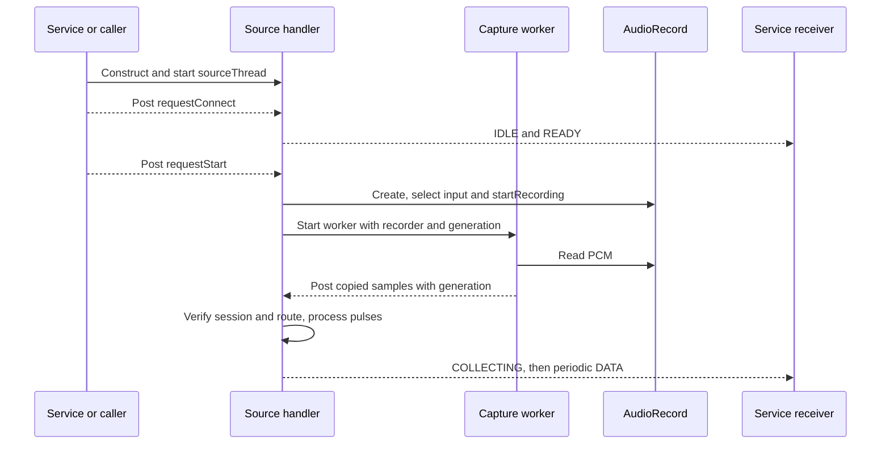
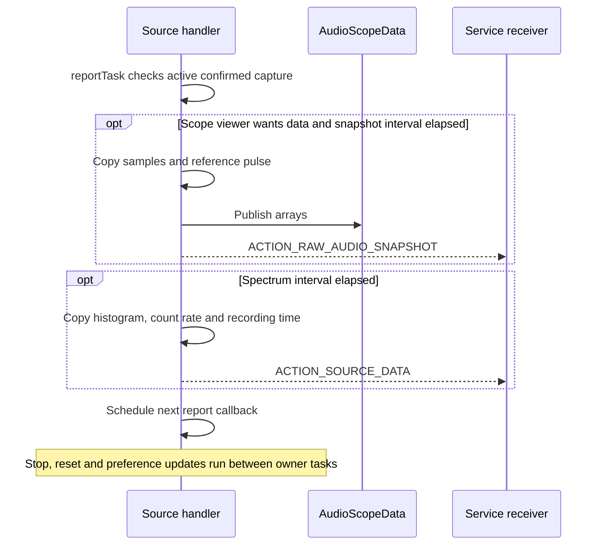
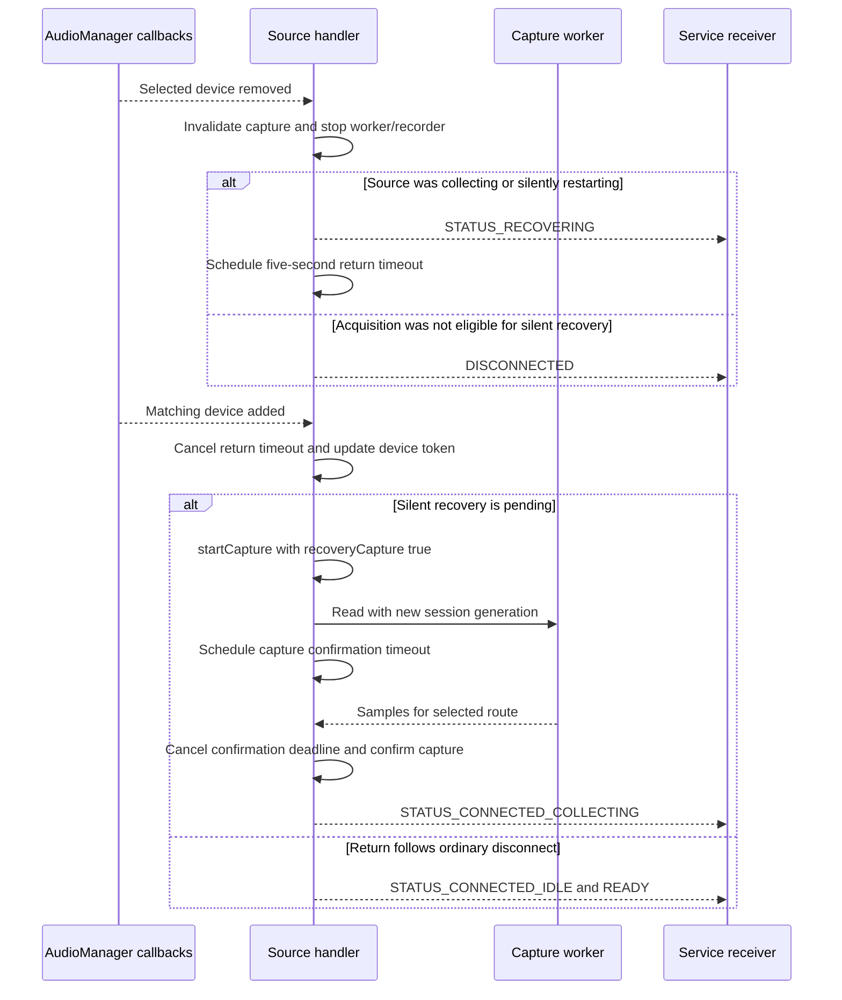
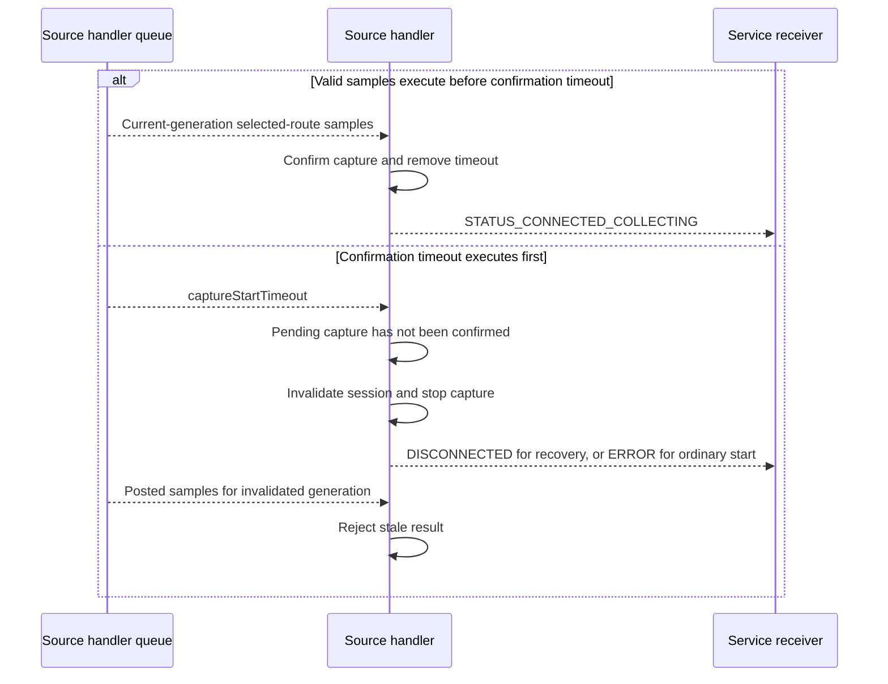
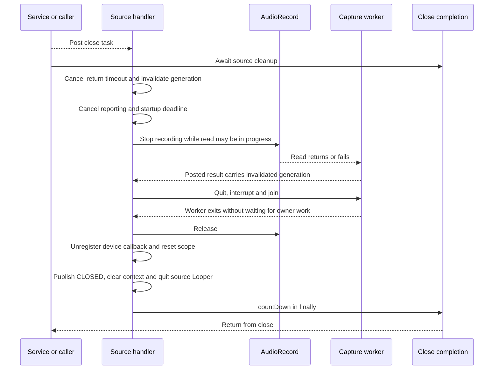

# Audio source threading and capture lifecycle

This document describes
[AtomSpectraAudioSource](../app/src/main/java/org/fe57/atomspectra/AtomSpectraAudioSource.java):
thread ownership, microphone startup, PCM handoff, pulse processing, reporting,
device recovery and shutdown. Application-level recording and device selection
are covered in [Device session state machine](device-state-machine.md).
All sources follow its [Recovery Event Contract](device-state-machine.md#recovery-event-contract).

The central rule is: **the source handler owns mutable acquisition state; the
capture worker reads PCM and posts session-tagged results without waiting for
lifecycle decisions.**

Sequence diagrams use Mermaid. Asynchronous arrows represent posted tasks,
callbacks or broadcasts. Ordinary calls execute synchronously on their indicated
thread.

## 1. Execution contexts and ownership

| Context | Lifetime | Responsibilities |
|---|---|---|
| Service or other caller | External to the source | Issue requests, read published metadata, call synchronous `close()` |
| `sourceThread`, named `AtomSpectraAudioSource` | Constructed with the source; stopped by `close()` | Run `sourceHandler`; own device selection, lifecycle, recorder setup/stop/release, deadlines, PCM interpretation and publication |
| `captureThread`, named `AtomSpectra-Audio-Capture` | One per capture session | Read a captured `AudioRecord` into a private buffer and post results with the session generation |
| Service broadcast receiver | External to the source | Consume status, readiness, errors, cumulative spectra and raw-audio notifications |

Android's internal audio service is outside the source's thread ownership. The
source uses no `Timer` threads. Device callbacks are registered with
`sourceHandler`, and recovery, startup and reporting callbacks use that same
handler. The source does not require the Android main looper for lifecycle work.



### State ownership

| State | Owner | Cross-thread access |
|---|---|---|
| Device callback registration, device token, capture lifecycle and deadlines | Source handler | Device token and metadata are volatile for publication |
| `audioRecord` | Source handler controls creation, start, stop and release | Worker holds the recorder captured for its session and only calls `read()` |
| `capturing`, `captureConfirmed`, `recoveryCapture`, `captureThread` | Source handler | Not read by the worker to decide lifecycle transitions |
| `captureGeneration` | Source handler increments on session invalidation | Volatile; worker checks it before reading and owner checks it before processing |
| Histogram, processed-sample count, count-rate bins, reference pulse and sample snapshot | Source handler | Published as copied arrays in broadcasts or `AudioScopeData` |
| Pulse-selection settings, audio mode and report counters | Source handler | Settings remain individually volatile; pulse processing itself is serialized with updates |
| Worker read buffer | Capture worker | Copies are handed to the source handler; the worker never modifies a published copy |
| `status`, `lastError`, `deviceId`, `context` | Source handler | Volatile getters/closure checks used by callers |

There are no source-level lifecycle, capture or histogram monitor locks.
Thread confinement provides exclusion for owned state. Volatile metadata
publishes individual values, not an atomic snapshot of every getter.

`CountDownLatch` in `close()` signals completion to an off-handler caller. It
does not protect acquisition state or block the worker from finishing a read.

## 2. Public request dispatch

`deferToSourceThread()` implements the entry boundary:

1. If `context == null`, ignore work for the closed source.
2. If the caller is already on `sourceHandler`, execute immediately.
3. Otherwise, post the request; its wrapper checks closure again before execution.

Connection, start/stop/reset, preferences, calibration writes and explicit data
requests use this boundary. `setInitialHistogram()` copies its caller's array
before posting. Calibration writes likewise copy their input coefficients.

Requests from one caller are posted in call order. In particular, a service call
to `setInitialHistogram()` followed by `requestStart()` installs the initial
histogram before starting capture. Requests from different producers are ordered
by handler execution, not by an assumed wall-clock order across threads.

Most request methods return after posting, not after hardware completion.
Source broadcasts communicate completion. `close()` waits for source cleanup.

`setInitialHistogram()` checks acquisition state on the owner and rejects a
capturing session, including startup that has not yet reported collecting.
This keeps cumulative spectrum replacement separate from live accumulation.

## 3. Connection and confirmed startup

`requestConnect()` verifies microphone permission and locates the selected input.
A selected non-default device is monitored on API 23+. If it is absent, the
source remains disconnected and waits for a matching device-add callback.

`completeConnect()` loads preferences, updates the label, reports connected idle
and emits `READY`. Readiness describes the selected source and its spectrum
interface; it does not imply acquisition is running.

`startCapture()` performs microphone setup on the source handler:

1. Stop and invalidate any active capture session.
2. Mark capture pending, with ordinary startup busy or silent restart recovering.
3. Validate the minimum buffer size and allocate processing state.
4. Construct `AudioRecord` and require `STATE_INITIALIZED`.
5. For a selected non-default input on API 23+, require a device token and a
   successful `setPreferredDevice()` result.
6. Call `startRecording()` and require `RECORDSTATE_RECORDING`.
7. Start the capture worker and schedule a five-second confirmation deadline.

```mermaid
sequenceDiagram
    participant Caller as Service
    participant Owner as Source handler
    participant Record as AudioRecord
    participant Worker as Capture worker
    participant Receiver as Service receiver
    Caller-->>Owner: requestStart
    Owner->>Owner: Invalidate session and initialize capture state
    Owner-->>Receiver: STATUS_CONNECTED_EXECUTING_COMMAND
    Owner->>Record: Construct and verify initialization
    Owner->>Record: Prefer selected input if applicable
    Owner->>Record: startRecording and check recording state
    Owner->>Worker: Start read task with captured generation
    Owner->>Owner: Schedule confirmation timeout in five seconds
    Worker->>Record: Read samples
    Worker-->>Owner: Post samples and generation
    Owner->>Record: Verify selected routed device if applicable
    alt Samples belong to the selected route
        Owner->>Owner: Confirm capture and cancel startup timeout
        Owner-->>Receiver: STATUS_CONNECTED_COLLECTING
        Owner->>Owner: Process samples and schedule reports
    else Route is not yet confirmed
        Owner->>Owner: Discard samples; continue bounded confirmation
    end
```

`STATUS_CONNECTED_COLLECTING` requires positive-length PCM data and route
confirmation. A recorder that has started but has not delivered the selected
input's samples remains pending. During silent restart, it remains recovering
until those same checks succeed.

The route is checked with `getRoutedDevice()` on API 23+ for non-default
selection; its ID must equal the current selected device token's ID. Default
input follows Android's default routing policy and does not require a specific
device ID.

## 4. PCM worker and bounded handoff

The worker captures immutable session parameters: recorder, generation, buffer
and nominal read interval. It never opens or replaces the recorder, processes
pulses, modifies histogram state or reports lifecycle success.

On API 23+, reads use `READ_NON_BLOCKING`. On API 21/22, the worker uses the
blocking read API. Both execute outside the source handler.

```mermaid
sequenceDiagram
    participant Worker as Capture worker
    participant Record as AudioRecord
    participant Owner as Source handler
    Worker->>Worker: Verify captured generation
    Worker->>Worker: Record read start time
    Worker->>Record: Read into worker-private buffer
    Record-->>Worker: Byte count or error
    Worker->>Worker: Copy positive-length PCM
    Worker-->>Owner: Post result tagged with generation
    Note over Worker: Return to Looper; do not wait for owner
    Owner->>Owner: Reject stale generation or process current result
    Owner->>Owner: Confirm routing and accumulate samples
    opt Session remains current
        Owner-->>Worker: Schedule next read after remaining interval
    end
```

Only one result awaits owner processing for a session. The owner schedules the
next read after consuming the result, so the worker does not fill an unbounded
queue of PCM copies while acquisition state is busy.

Read pacing uses:

```text
interval = max(1, 1000 * bufferSize / 2 / SAMPLE_RATE)
next delay = max(0, interval - elapsed time since this read began)
```

Elapsed time includes the read and owner processing. A blocking read that already
used the interval can therefore be followed immediately by the next read.
The worker never synchronously waits for the owner; an idle worker can always
exit when its Looper is stopped.

## 5. Capture generations and invalidation

`captureGeneration` identifies the active capture lifetime within one source
object. It is separate from the source instance ID attached to broadcasts.

`stopCapture()` increments this generation before cancelling callbacks or
touching the recorder. A worker checks its captured generation before beginning
another read. Posted PCM and read exceptions check generation on the owner
before changing any state.

```mermaid
sequenceDiagram
    participant Worker as Worker for generation g
    participant Queue as Source handler queue
    participant Owner as Source handler
    Worker-->>Queue: Post PCM tagged g
    Owner->>Owner: stopCapture advances generation to g+1
    Owner->>Owner: Cancel report and confirmation callbacks
    Owner->>Owner: Stop recorder, join worker and release resources
    Queue-->>Owner: Deliver result tagged g
    Owner->>Owner: Generation mismatch; discard without processing
    Owner->>Owner: Start replacement session using current generation
    Note over Owner: Stale samples and failures cannot mutate the replacement session
```

The owner also checks `context` and `capturing` in `onAudioRead()`. There is no
concurrent owner teardown while that method processes a current chunk.
The worker's buffer is session-local and its result array is copied before
posting, so later reads cannot change samples being processed.

## 6. Pulse processing, reporting and reset

`onAudioRead()` verifies the session and route, then `captureAudioChunk()` runs
PCM conversion and pulse detection on the source handler. The histogram,
reference pulse, latest samples, total sample count and rolling count-rate bins
all have the same owner.

Recording time is derived from processed samples at 44,100 samples per second,
not from the handler's wall-clock reporting interval. Count-rate bookkeeping
retains its nominal capture/report cadence.

Reports begin after capture confirmation. `reportRunnable` executes every
nominal 100 ms on the source handler. It advances counters for the configured
spectrum interval and the 200 ms raw-audio snapshot interval.



`requestShowData()` posts an explicit snapshot request to the same owner.
`requestReset()` clears histogram/time/count-rate/reference data and resets
scope publication on that owner. Initial histogram installation and preference
changes are serialized with pulse processing as well.

Snapshot creation and the source's broadcast call occur in one owner operation.
Stop removes pending report callbacks, and `reportTask()` checks that capture is
confirmed before publication. Source close resets scope only after capture and
report scheduling have been stopped.

Broadcast delivery remains asynchronous: a broadcast already sent can still
reach its receiver after a later source operation. The service's instance-ID
filter identifies the source object, not the capture generation.

## 7. Selected-device loss and recovery deadlines

For a selected non-default input on API 23+, removal is matched against the
current device token's ID and addition against its stable audio identity.
Callbacks execute on `sourceHandler`. A returned device replaces the token used
to prefer and verify routing.

Recovery has two separate stages:

| Stage | Budget | Meaning |
|---|---|---|
| Waiting for a device return | Five seconds after eligible loss cleanup | The selected device must become available |
| Confirming restarted capture | Five seconds from the input's return | Positive-length samples must come from the selected route |

The capture confirmation deadline is fixed when the input returns. Transient
startup/read failures stop and invalidate that attempt and retry after up to
250 ms within the remaining budget. Retries do not reset the five-second
deadline. Exhaustion reports disconnected without a ready event. Permission
loss reports disconnected followed by a terminal connect error.



A collecting silent recovery reports a status transition, without an intermediate
idle or ready event. Ordinary connection and return after disconnection report
idle and `READY`, allowing the service to decide whether acquisition should start.

Timeout, return and read-confirmation callbacks cannot mutate lifecycle state
simultaneously because they share the source handler.



The owner queue determines the winner. Physical receipt of bytes before a
deadline is not itself confirmation until the owner has validated them.

## 8. Failures and preference changes

Ordinary initialization/startup/read/processing failure stops capture, reports
`STATUS_CONNECTED_COMMAND_FAILED` and emits `ACTION_SOURCE_ERROR` with `OP_START`.
Permission errors use `OP_CONNECT`. While silent restart is pending, transient
failures retry within the fixed capture deadline; exhaustion reports disconnected
and lets the service suspend recording.

The confirmation timeout also covers initial zero-length reads or samples not
yet routed to the selected device. After confirmation, five consecutive
zero-length reads fail capture. A negative read result or read/processing
exception ends the current attempt. During recovery, it may be retried within
the budget. A changed or missing selected
route after confirmation also fails capture; those samples are not accumulated.

Preference updates are owner tasks. Pulse-selection changes clear the reference
pulse before subsequent chunks are processed with the new settings. An audio
mode change during capture restarts the recorder and worker with a new generation
and requires capture confirmation again. The cumulative histogram and processed
sample time remain available across that restart.

## 9. Stop and synchronous close

`stopCapture()` executes in this order:

1. Increment the volatile capture generation.
2. Clear capturing, confirmation and recovery-capture flags.
3. Remove report and startup-confirmation callbacks.
    Cancel any pending recovery-capture retry as well.
4. Call `AudioRecord.stop()` when the recorder is recording.
5. Quit and interrupt the capture worker, then join it.
6. Release and clear the recorder after the worker has exited.

Stopping the recorder occurs before joining. The read owns no source monitor,
so the handler can call stop while a blocking read is in progress. The recorder
is not released while its worker can still be using it.

`requestStop()` also removes the device-return timeout. Stopping while recovering
reports disconnected rather than leaving a pending automatic restart. Otherwise
it reports connected idle. If the selected input remains present with microphone
permission, cancellation is followed by `READY` with idle status. That readiness
does not start capture; the service's current recording intent controls any start.



An off-handler `close()` posts owner cleanup and waits on a latch. An owner call
cleans up directly, so it does not wait on its own Looper. Interrupted latch
waits and worker joins continue cleanup and restore interruption afterward.
The close task signals its caller in `finally`.

A successful close returns after recorder and worker cleanup, though the source
Looper may still be completing its exit. Deferred operations check closure;
read callbacks check generation. Neither can start a replacement session after
the source has closed.

## 10. Timing and verification boundaries

Handler delays use Android uptime, which does not advance in deep sleep; recovery
deadlines and logged durations use `SystemClock.elapsedRealtime()`. Five-second
confirmation is a queued deadline, not a hard wall-clock bound on a platform call that blocks inside recorder setup.
Likewise, worker join and the close latch have no overall timeout. Shutdown does
not require the read to acquire a source lock, but still depends on platform
audio calls returning after stop.

Backpressure bounds PCM handoff to one pending result. If owner processing takes
too long, Android's recording buffer can still overflow; handler scheduling does
not guarantee lossless operation under arbitrary CPU or device-service stalls.

The implementation has passed debug Java compilation. No tests were added or
run. Microphone routing, sample throughput, device-return timing and platform
shutdown behavior remain unverified on physical hardware in this workspace.