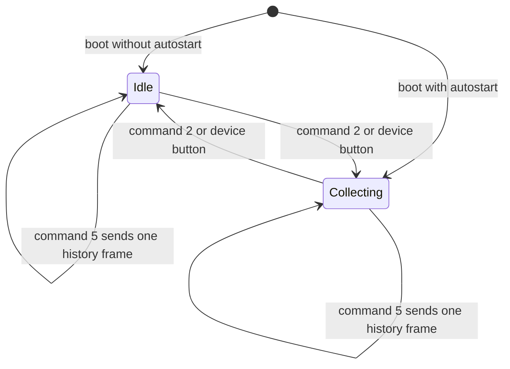

# BluZ Device Protocol

BLE transport, device acquisition states, periodic frames and command payloads.
Updated 2026-10-06. Application session ownership, selection, reconnect and
screen-spectrum decisions are described in [device-state-machine.md](device-state-machine.md).

## Reference and Confidence

This reference is based on the executable code of the BluZ v2 Android app
(versionName 1.13) and the local `BluZ_LPM` firmware checkout. The installed v2
app works with the user's device, but that device's firmware version is unknown.
Local firmware behaviour is therefore evidence, not confirmation of that exact
device. No hardware captures were made during this integration.

The older BluZ Android app and the separate `BluZ_LPM_v2` firmware are not the
primary references. In particular, command 8 exists in local `BluZ_LPM` but not
in `BluZ_LPM_v2`. Comments and older protocol notes sometimes disagree with
executable code; the tables below follow the code. Command write length remains
a compatibility caveat, described below.

AtomSpectra implementations:

- [BluZFrameDecoder.java](../app/src/main/java/org/fe57/atomspectra/BluZFrameDecoder.java): frame assembly, checksum, header and histogram decoding.
- [BluZCommandCodec.java](../app/src/main/java/org/fe57/atomspectra/BluZCommandCodec.java): command envelope and settings mapping.
- [BluZBleSource.java](../app/src/main/java/org/fe57/atomspectra/BluZBleSource.java): GATT transport and frame-confirmed operations.

## BLE Transport

| Item | Value |
|---|---|
| Service | `0000fe80-cc7a-482a-984a-7f2ed5b3e58f` |
| Device-to-client characteristic | `0000fe81-8e22-4541-9d4c-21edae82ed19` |
| Client-to-device characteristic | `0000fe82-8e22-4541-9d4c-21edae82ed19` |
| CCCD | `00002902-0000-1000-8000-00805f9b34fb` |
| MTU requested by v2 and AtomSpectra | 251 |
| Write type | Write without response |
| Write chunk size used by v2 | 248 bytes, followed by the remaining 7 command bytes |
| Connection priority | High |
| Advertised local name | `BluZ` |
| Manufacturer data | Company ID `0x0030`, four data bytes; local firmware uses `0xFFFFFFFF` on overload |

The local firmware does **not** advertise the service UUID. Discovery should
use the local name, not a service-UUID advertisement filter. A known device can
be identified by its MAC address.

Clients discover the service, negotiate MTU, enable the incoming characteristic
and write its CCCD. Prefer indication if the characteristic supports it;
otherwise use notification. CCCD completion establishes transport readiness,
not knowledge of acquisition state or settings: those require a valid frame.
AtomSpectra requires negotiated MTU >= 251 for its v2-compatible writes.

## Device States and What Is Sent

Dosimetry and spectrometer acquisition are separate. Stopping the spectrometer
does not stop periodic dosimeter, settings or log transmission to a subscribed
client.

| Device condition | Frames sent | Spectrum/time behaviour |
|---|---|---|
| No subscribed BLE client | No periodic GATT frames | Acquisition may still run; disconnect is not a stop command |
| Spectrometer stopped | Type 0: header/settings, dosimeter ring and log | Accumulated spectrum remains in RAM but is not transmitted; spectrometer time is retained |
| Running at 1024 | Type 1: common payload plus 1024-channel live spectrum | Adjacent groups of four raw bins are summed |
| Running at 2048 | Type 2: common payload plus 2048-channel live spectrum | Adjacent groups of two raw bins are summed |
| Running at 4096 | Type 3: common payload plus 4096-channel live spectrum | One raw bin per transmitted channel |
| History requested | One type 4, 5 or 6 frame, then the previous normal type | Separate history buffer, not the accumulated live spectrum |

All complete frames, including type 0 and history replies, carry the common
settings snapshot. However, **configured resolution is absent from the common
header**. It is revealed by live/history frame type only. Current running state
is inferred from normal types: 0 is stopped, 1-3 are running. Types 4-6 do not
prove running or stopped state and must not change the client's last observed
normal state. The stored autostart flag is not current running state.

Command 2 toggles, rather than sets, acquisition. Start resumes accumulated
counts and spectrometer time; stop clears neither. Only command 1 or an ADC
sample-time change through command 0 clears the live buffer, spectrometer pulse
count and spectrometer time. A resolution-only change clears none of them.

## Transmission Cycle

Local firmware sends a complete frame when `connectFlag` is true and
`interval2 < intervalNow`, then assigns `interval2 = intervalNow + INTERVAL2`.
`INTERVAL2` is 5 in the reviewed checkout. This is a scheduler rule, not a
guaranteed arrival interval: its strict comparison, timer tick and BLE transfer
duration must be considered before assuming exact wall-clock cadence.

Each cycle constructs the header/settings, 512-entry dosimeter ring and 50-entry
log, with a spectrum only when the selected frame type requires one. A complete
frame is sent as a burst of notifications. It is not one notification per
channel, and clients need not request every snapshot.

Command 5 sets `historyRequest` and resets `interval2` to 0, making the next
eligible cycle a history reply. Firmware chooses history type from the current
resolution, then restores the previous normal frame type. History does not start
or stop acquisition.

## Frame Envelope and Reassembly

The first notification starts with ASCII `<B>` (`3C 42 3E`), followed by an
unsigned type byte at offset 3. Continuation notifications have no sequence
number or repeated header. Type determines the expected notification count.

| Type | Histogram kind | Channels | Notifications | Meaningful reassembled bytes |
|---|---|---|---|---|
| 0 | None | 0 | 6 | 1424 |
| 1 | Live | 1024 | 16 | 3472 |
| 2 | Live | 2048 | 23 | 5520 |
| 3 | Live | 4096 | 40 | 9616 |
| 4 | History | 1024 | 16 | 3472 |
| 5 | History | 2048 | 23 | 5520 |
| 6 | History | 4096 | 40 | 9616 |

The raw firmware payload uses 244-byte chunks. In the final chunk, offsets
242-243 hold the 16-bit little-endian sum checksum. Concatenate ordinary chunks'
bytes 0-243 and the last chunk's bytes 0-241, then compare their byte sum modulo
65536 with that checksum. Frame padding after the meaningful payload participates
in the checksum and is not spectrum data.

AtomSpectra also accepts 248-byte notifications, taking the first 244 bytes per
ordinary notification and excluding its trailing four bytes; on the final
notification it takes 242 payload bytes and reads checksum at 242-243. This
matches the v2 app's stripping rules for 248-byte notifications. For raw
244-byte notifications AtomSpectra retains the full firmware payload, rather
than stripping another four bytes. Actual notification length on the user's
firmware still needs capture. Size must remain consistent within one frame.

A new `<B>` abandons an incomplete frame and starts another. Missing or
duplicated notifications cannot be diagnosed from a sequence number; checksum,
completeness and an assembly deadline gate publication. The checksum is a simple
sum, not a CRC or cryptographic integrity check. Clients must not apply settings
or publish a histogram from an incomplete or unchecked frame.

## Common Header and Payload

Offsets are bytes in the reassembled buffer. The first notification contains
the entire 100-byte header, so the first-packet fields have the same offsets.
All multi-byte header values are little-endian; floats are 32-bit IEEE 754.
Unspecified bytes are reserved or not interpreted by the reviewed clients.

| Offset | Size | Field |
|---|---|---|
| 0 | 3 | ASCII `<B>` |
| 3 | 1 | Frame type, 0-6 |
| 4-9 | 6 | Reserved/not interpreted |
| 10 | 4 | Dosimeter total pulses, uint32 |
| 14 | 4 | Pulses per second, uint32 |
| 18 | 4 | Dosimeter total time, uint32 seconds |
| 22 | 4 | Average CPS, float |
| 26 | 4 | Temperature, float |
| 30 | 4 | Battery voltage, float |
| 34 / 38 / 42 | 4 each | Firmware 1024 calibration A / B / C |
| 46 | 4 | CPS-to-uR/h coefficient, float |
| 50 / 52 | 2 each | HV / comparator settings, 10-bit values in uint16 |
| 54 / 56 / 58 | 2 each | Alarm thresholds 1 / 2 / 3, uint16 |
| 60 | 1 | LED, sound and per-alarm flags |
| 61 | 1 | Autostart and divide-by-10 flags |
| 62 / 66 / 70 | 4 each | Firmware 2048 calibration A / B / C; v2 uses 66/70 as quartic D/E |
| 74 / 78 / 82 | 4 each | Firmware 4096 calibration A / B / C; v2 quartic A/B/C |
| 86 | 4 | Spectrometer acquisition time, uint32 seconds |
| 90 | 4 | Spectrometer pulse count, uint32 |
| 94 | 2 | Dosimeter averaging window, uint16 |
| 96 | 1 | Bits per channel, 16-32; default 20 |
| 97 | 1 | ADC sample time in bits 0-2; overload flag in bit 3 |
| 98-99 | 2 | Reserved/not interpreted |
| 100 | 1024 | Dosimeter ring: 512 little-endian uint16 values |
| 1124 | 300 | Log: 50 entries, each uint32 time + uint16 event type |
| 1424 | 2 times channel count | Compressed spectrum/history, present only for types 1-6 |

The dosimeter pulse/time totals are distinct from spectrometer pulse/time.
Command 3 resets dosimeter accumulation; command 1 resets spectrometer
accumulation. Spectrometer time advances only while acquisition runs and remains
visible in the header even when the spectrum itself is not sent.

### Configuration Bits

| Byte | Bits | Meaning |
|---|---|---|
| 60 | 0 | LED for pulses |
| 60 | 1 | Sound for pulses |
| 60 | 2 / 3 / 4 | Alarm sound at levels 1 / 2 / 3 |
| 60 | 5 / 6 / 7 | Alarm vibration at levels 1 / 2 / 3 |
| 61 | 0 | Spectrometer autostart on power-up |
| 61 | 1 | Pulse sound divided by 10 |
| 61 | 2 | Pulse LED divided by 10 |
| 97 | 0-2 | ADC sample-time setting |
| 97 | 3 | SiPM overload |

Header settings omit resolution, service-event vibration `VibroEnable`, and
battery calibration coefficient `battKoeff`. The latter two are stored in flash
but are not assigned by command 0, so that command preserves their RAM values.
The transmitted battery voltage already has `battKoeff` applied.

## Spectrum Storage and Compression

Firmware accumulates a 4096-bin RAM spectrum of raw ADC channels. When building
a frame, resolution selects groups of 4, 2 or 1 adjacent bins for 1024, 2048 or
4096 output channels. Resolution affects transmission, not which raw bins are
accumulated. Changing only resolution needs neither a reset nor a brief stop.

Each grouped count is logarithmically compressed into a little-endian uint16
code. For code $v$ and advertised bits per channel $b$, decode as:

$$
\operatorname{count} = \exp\left(\frac{v b \ln 2}{65535}\right) - 1
$$

Compression is lossy. Integer display requires rounding after decompression;
channel differences between frames can be coarse, and changing transmitted
resolution does not yield an exact regrouping of decoded counts. Local firmware
can increase bits per channel when counts grow, so read it from every frame.

The history spectrum is a different RAM buffer, filled while acquisition runs
and an alarm level is exceeded. It may be all zeros on a device that never ran.
It is not the live accumulated spectrum and is not retained across power cycles.
Command 5 cannot retrieve the hidden live spectrum of a stopped device.

## Calibration Interpretation

Local firmware names nine float slots as three per-resolution quadratics. The
v2 app instead uses a quartic in 4096-bin units:

$$
E(x) = A x^4 + B x^3 + C x^2 + D x + E_0,
\qquad x = \frac{4096}{N}\,\mathrm{channel}
$$

For a native $N$-channel spectrum, lowest-order-first coefficients are
`{E0, D*s, C*s^2, B*s^3, A*s^4}`, with `s = 4096/N`. A/B/C come from header
74/78/82; D/E0 come from 66/70, repurposing the firmware's 2048 B/C slots.
Devices never calibrated by the v2 app may hold unrelated values in those slots.
The v2 app evaluates integer channel indices, not an explicit half-bin shift.

For AtomSpectra's fixed 4096 output, coefficients are `{E0, D, C, B, A}`.
Validation/default fallback belongs to the application's calibration model.
Read-modify-write settings must preserve all nine raw float bit patterns, even
the slots the v2 app no longer exposes in its decoded settings model.

## Command Envelope and Compatibility

| Offset | Contents |
|---|---|
| 0-2 | ASCII `<S>` (`3C 53 3E`) |
| 3 | Command code |
| 4 onward | Command-specific payload; other bytes zero-padded |
| 242-243 | Little-endian uint16 sum of bytes 0-241 |
| 244-254 | Remaining zero padding in the v2/AtomSpectra 255-byte buffer |

The v2 app and AtomSpectra submit this buffer as sequential writes of 248 and
7 bytes. A GATT completion callback is not an application-level command ACK.
For acquisition/resolution/reset operations, normal frames provide evidence
that the requested effect happened; the reviewed protocol has no dedicated
success/error reply envelope.

**Unresolved local-firmware discrepancy:** its receiver sums bytes using
`index < Length - 3` but reads checksum at fixed offsets 242/243. Summing exactly
0-241 implies `Length = 245`, which does not directly match the v2 writes.
The installed v2 app is working on the user's hardware, whose firmware version
is unknown. AtomSpectra follows that app's write framing, not an inferred
245-byte alternative. Capture actual writes and device-side reported length
before claiming the local firmware and installed device are equivalent.

### Commands and Effects

| Code | Payload | Effect |
|---|---|---|
| 0 | Settings block below | Replaces writable settings and rewrites flash |
| 1 | None | Clears all 4096 live bins, spectrometer pulse count and time; does not toggle acquisition |
| 2 | None | Toggles spectrometer on/off; does not clear data or write flash |
| 3 | None | Clears dosimeter pulse/time accumulation and ring |
| 4 | None | Clears log storage; local firmware records the clear event |
| 5 | None | Requests one history frame at current resolution, then returns to normal frames |
| 6 | None | Finds device using sound and vibration |
| 7 | Big-endian float at 4 | Supplies real battery voltage; firmware derives/stores its voltage calibration coefficient |
| 8 | None | Clears history spectrum; local `BluZ_LPM` only |

Command 7 is battery calibration, not a request for a voltage report. Battery
voltage is already sent in every frame at offset 30. Neither disconnect nor
resubscribe implicitly resets or stops acquisition.

### Command 0 Settings Map

Offsets below are absolute command-buffer bytes, including `<S>` and code.
Incoming header order is little-endian; outgoing settings have mixed order.
`BluZCommandCodec` copies raw coefficient bytes in reverse order rather than
parsing/reformatting them, preserving their bit patterns.

| Command offset | Encoding | Setting | Incoming header offset |
|---|---|---|---|
| 4 / 8 / 12 | uint32 big-endian | Alarm thresholds 1 / 2 / 3 | 54 / 56 / 58, uint16 little-endian |
| 16 | Float big-endian | CPS-to-uR/h coefficient | 46 |
| 20 | Byte | LED/sound/per-alarm flags | 60, unchanged |
| 21 / 25 / 29 | Floats big-endian | Firmware 1024 A / B / C | 34 / 38 / 42 |
| 33 / 35 | uint16 little-endian | HV / comparator | 50 / 52 |
| 37 | Byte enum | Resolution: 0=1024, 1=2048, 2=4096 | Not in header |
| 38 | Bitfield | Autostart, sample time, sound/LED dividers | Rebuild from 61 and 97 |
| 39 / 43 / 47 | Floats big-endian | Firmware 2048 A / B / C; v2 D/E occupy 43/47 | 62 / 66 / 70 |
| 51 / 55 / 59 | Floats big-endian | Firmware 4096 A / B / C | 74 / 78 / 82 |
| 63 | uint16 little-endian | Dosimeter averaging window | 94 |
| 65 | Byte | Bits per channel | 96 |

Command byte 38 uses bit 0 for autostart, bits 1-3 for sample time, bit 4 for
sound divided by 10 and bit 5 for LED divided by 10. Header byte 61 bits 0/1/2
map to command bits 0/4/5; header byte 97 bits 0-2 map to command bits 1-3.
The overload flag is not written back as a setting.

Alarm values are 32-bit on the wire but uint16 in firmware RAM/flash; copied
header values fit, and outgoing upper bytes are zero. A resolution-only update
sets byte 37 to 2 and preserves every other writable setting. **Changing sample
time clears the live spectrum and time**, even if the caller only meant to
change resolution. There is no dedicated set-resolution or flash-read command.

AtomSpectra retains the 100-byte settings header from every checksum-validated
complete frame, including history frames; history still does not change the
observed acquisition state. A calibration save uses the latest retained header
as its command-0 read-modify-write base. The five app coefficients `{E0, D, C,
B, A}` are encoded as float32 values at command offsets `47, 43, 59, 55, 51`;
the other four raw calibration slots and all unrelated settings are preserved.
The save sets byte 37 to 2, so saving while idle may change the configured
resolution to 4096. A later normal frame (type 0-3) must report the requested
float32 coefficients before AtomSpectra reports the save as successful. A type-0
frame can confirm the coefficients while idle, but cannot confirm the selected
resolution; that is visible only in a live frame type.

Command 0 rewrites flash on every accepted call, even if settings already match.
The local firmware has a warning that flash writing may require a second call;
this is not permission to retry automatically. Observe effects and verify normal
power-cycle persistence on the actual firmware. Do not deliberately interrupt
a flash write as a routine check. Reflashing the user's devices is not available.

## Client Data Policy

AtomSpectra reports a constant 4096-channel spectrum. For a decoded integer count
`count` in a 1024/2048 frame, split directly across `factor = 4096/N` adjacent
bins: each receives `count / factor`, and the first `count % factor` bins receive
one extra. Thus one 1024-bin count of 5 becomes `[2, 1, 1, 1]`; one 2048-bin count
of 5 becomes `[3, 2]`. This preserves decoded totals, not physical fine-bin detail.

The client retains lower-resolution live frames and changes resolution only
after a live type 1/2 frame proves a mismatch. Type 0 alone causes no settings
write. An idle show request cannot retrieve accumulated live data; AtomSpectra
returns an empty 4096 histogram with time 0 rather than briefly starting the
device. History frames are never published as live data. Switching from expanded
to native 4096 bins may redistribute accumulated counts and distort per-channel
differences; the service's existing diffing calculation is unchanged.