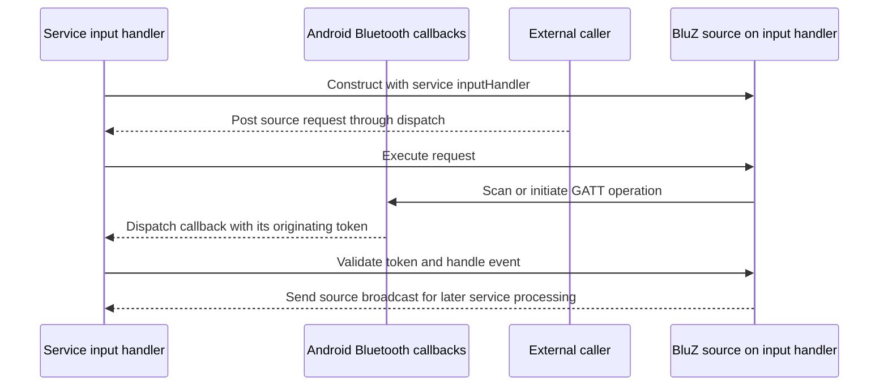
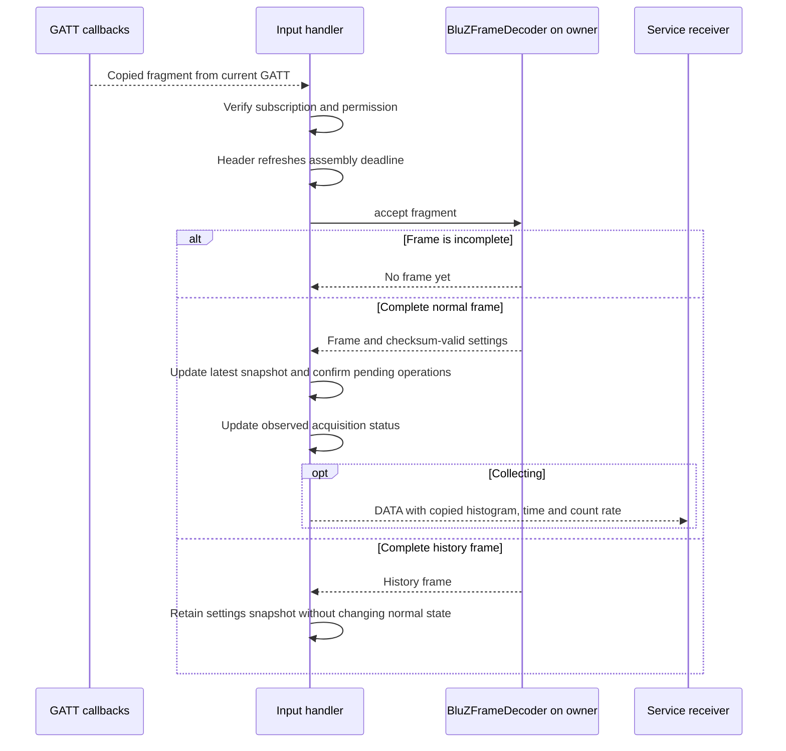
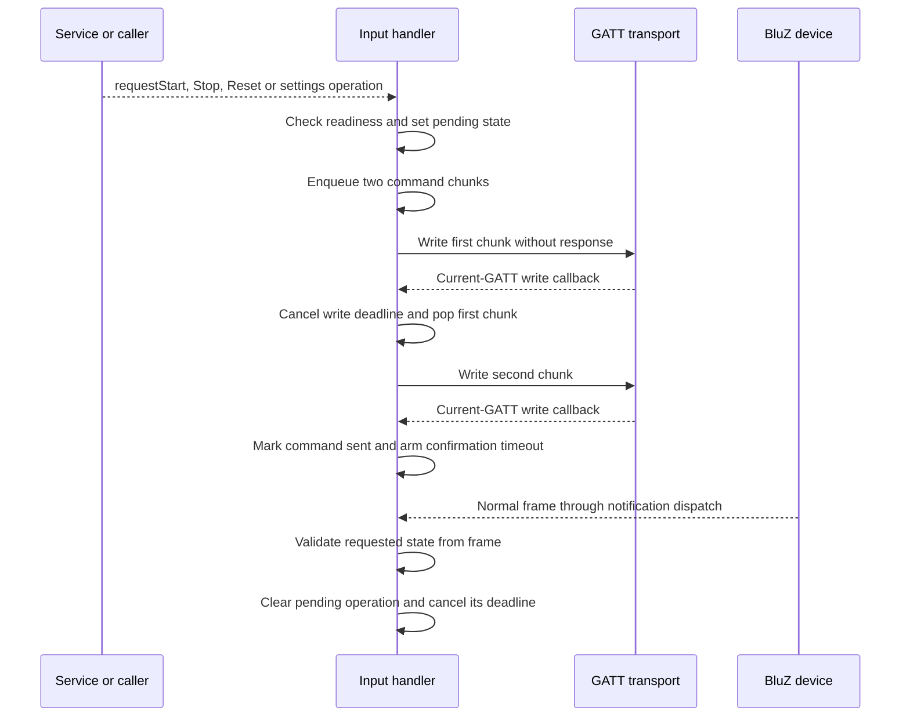
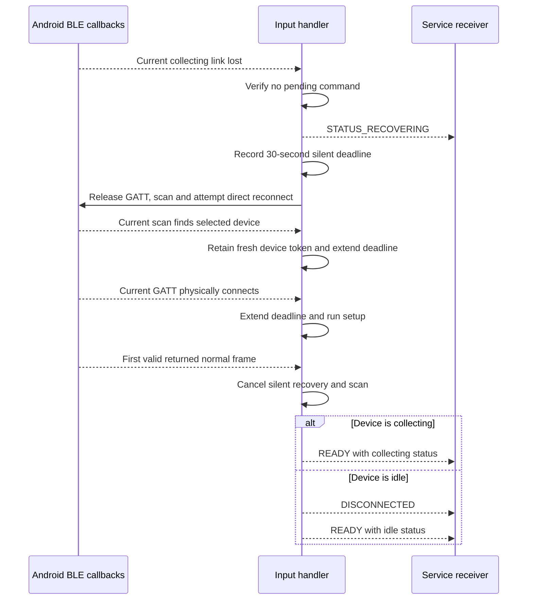

# BluZ threading and connection lifecycle

This document describes
[BluZBleSource](../app/src/main/java/org/fe57/atomspectra/BluZBleSource.java):
handler ownership, callback validation, frame processing, write serialization,
deadlines, recovery and shutdown. Wire layouts and firmware acquisition behavior
are described in [BluZ Device Protocol](bluz-device-protocol.md). Session ownership,
recording intent and picker behavior belong to
[Device session state machine](device-state-machine.md).

The central rule is: **all mutable BluZ source state belongs to the service input
handler; Android callbacks are dispatched there and validated before use.**

Sequence diagrams use Mermaid. Asynchronous arrows represent posted work,
Android callbacks or broadcasts. Ordinary method calls execute synchronously
on the indicated handler.

## 1. Execution contexts

| Context | Owner | Responsibilities |
|---|---|---|
| Service input thread, named `AtomSpectraInput` | `AtomSpectraService` | Run the handler supplied to BluZ; own source lifecycle, decoder, command state, deadlines and broadcast consumption |
| Android GATT callback context | Android Bluetooth stack | Deliver connection, service discovery, MTU, descriptor, notification and write callbacks |
| Android scan callback context | Android Bluetooth scanning | Deliver scan results/failures for the currently installed source scan |
| Adapter broadcast receiver context | Android broadcast delivery | Forward Bluetooth on/off changes through `dispatch()` |
| Public-method caller | Service/UI or another caller | Issue source operations and read published metadata |

BluZ does not create a source `HandlerThread`, packet worker, timer thread or
capture worker. It borrows the service's `inputHandler`; the service owns that
handler's lifetime. BLE I/O is performed by Android, while complete frame
interpretation runs on the service input handler.



The source and its broadcast receiver can share a Looper without the broadcast
being an immediate recursive method call. `sendBroadcast()` still delivers the
reply asynchronously through Android.

## 2. Dispatch and state ownership

`dispatch()` executes directly if already on `handler.getLooper()`; otherwise
it posts the action. Requests, GATT callbacks, scan callbacks and adapter changes
all enter through this boundary. Delayed tasks are scheduled on that handler.

| State | Owner / visibility |
|---|---|
| `gatt`, characteristics, `physicalConnection`, `subscribed`, `ready` | Input handler only |
| `scanCallback`, adapter receiver and retry scheduling | Input handler only |
| Decoder, `latest`, `latestSettings` | Input handler only |
| `writes`, `writing`, toggle/reset/settings confirmation state | Input handler only |
| Silent recovery state, deadline and scanned-device attempt bookkeeping | Input handler only |
| `stopOnReturn` | Input handler only; survives GATT replacement |
| `closed`, `terminal`, `hasBeenReady` | Input handler only |
| `status`, `lastError`, `coefficients` | Input-handler writes; volatile publication for getters |
| Address, source instance ID, context and handler | Immutable source configuration |

No source-level monitor locks are required for those owned fields. Two handler
operations cannot concurrently mutate the decoder, pop writes or replace GATT.
Volatile fields publish individual metadata values; they do not make multiple
getter calls one atomic snapshot. `calibration()` returns a coefficient copy.

`dispatch()` itself is not a closure filter: request methods and callback guards
check the appropriate source state. `reply()` suppresses broadcasts once closed.

## 3. Callback identity and copied payloads

Every GATT callback is validated with `current(candidate)` on the owner:

```text
not closed AND not terminal AND candidate == gatt
```

This compares the actual GATT object, not merely its address. A callback from a
released connection cannot affect another GATT connection to the same device.

Scan results similarly require that their callback object equals the currently
installed `scanCallback`. `stopScan()` clears that reference before asking Android
to stop scanning, making subsequently delivered callbacks obsolete.

Notification byte arrays are cloned before dispatch. The owner never reads a
characteristic value that Android may replace while the handler message waits.

```mermaid
sequenceDiagram
    participant Android as Android callback context
    participant Queue as Service input queue
    participant Owner as BluZ owner
    Android->>Android: Notification from GATT A
    Android->>Android: Clone payload
    Android-->>Queue: Post callback carrying A and copied payload
    Owner->>Owner: releaseGatt sets current gatt to null
    Owner->>Owner: Initiate replacement connection B
    Queue-->>Owner: Execute callback carrying A
    Owner->>Owner: A is not current B; ignore
    Android-->>Queue: Post notification carrying B
    Queue-->>Owner: Execute callback carrying B
    Owner->>Owner: Current connection; feed copied bytes to decoder
```

There is no numeric connection generation in this source. GATT and scan object
identity serve as connection/scan lifetime tokens. Handler-owned deadlines are
removed when their operation or connection is cleared.

## 4. Discovery, connection and readiness

Source waiting is separate from picker discovery. The source scans for its
locked MAC address using low-power scan mode; it does not choose a new device.
If Bluetooth is off, it waits for an adapter-state change. Retry backoff starts
at one second and doubles to a 30-second cap.

Connection setup proceeds through physical connection, service discovery, MTU
251, notification/indication enablement and the CCCD write. Subscription is
transport readiness, not proof of acquisition state.

```mermaid
sequenceDiagram
    participant Owner as Input handler
    participant Android as Android BLE stack
    participant Device as BluZ device
    participant Service as Service receiver
    Owner->>Android: Start locked-MAC scan
    Android-->>Owner: Current scan callback reports matching device
    Owner->>Android: Stop scan and connectGatt
    Android-->>Owner: Current GATT physically connected
    Owner->>Android: Discover services and request high priority
    Android-->>Owner: Services discovered
    Owner->>Android: Request MTU 251
    Android-->>Owner: MTU accepted
    Owner->>Android: Enable notifications/indications and write CCCD
    Android-->>Owner: CCCD write completed
    Owner->>Owner: Set subscribed true
    Device-->>Android: Frame fragments
    Android-->>Owner: Current-GATT copied fragments
    Owner->>Owner: Assemble first valid normal frame
    Owner->>Owner: Set status and calibration; cancel connection deadline
    Owner-->>Service: READY with status and 4096 channels
```

A complete, checksum-valid normal frame establishes source readiness. Idle is
type 0; collecting is types 1-3. History frames do not establish current
acquisition state. The first normal frame supplies calibration and the current
status along with `READY`.

Status is assigned before this ready event. A subsequent observed-status update
does not emit a duplicate status event when the value is unchanged. Later
acquisition changes use `ACTION_SOURCE_STATUS`.

### Handshake failure policy

- A connection attempt that expires before physical connection releases GATT
  and schedules another attempt.
- After physical connection, failure before the source has ever been ready can
  be terminal until explicit Retry.
- A handshake timeout after an earlier ready connection takes the regular
  disconnect/retry path.
- During silent recovery, non-permission setup failures fail that attempt and
  continue within the bounded recovery window.
- Permission loss is terminal for the source; the service handles the permission
  error by releasing the unusable session.

Explicit Retry clears terminal/error state and reconnects for a fresh frame
snapshot. The source does not treat a physical connection alone as recovery.

## 5. Frame assembly and data publication

`onPacket()` and `BluZFrameDecoder` execute on the input handler. A frame header
arms a ten-second assembly deadline; a completed frame cancels it. An incomplete
or interrupted frame produces a skipped-data notification rather than a partial
spectrum publication.



All output spectra contain 4096 channels. Lower-resolution live spectra are
expanded count-preservingly by the decoder. A proven live resolution mismatch
may queue a preserving settings write; a later 4096-channel frame confirms it.
Repeated mismatch does not continually enqueue flash writes. Idle connection
does not probe resolution, change settings or start acquisition automatically.

`requestShowData()` publishes the current live frame if collecting, otherwise
an empty idle histogram. BluZ cannot accept an initial histogram supplied by the
service. Calibration writes use the latest settings snapshot and are confirmed
by matching coefficients in a normal frame.

## 6. Write queue and frame-confirmed commands

Each logical command is encoded into two GATT write chunks. Both are added to
the handler-owned `writes` queue. `writing` permits only one outstanding GATT
write. The completion callback advances the queue; the second chunk's completion
marks the logical command sent and starts its frame-confirmation deadline.



A GATT callback is transport progress, not firmware state confirmation.
Start/Stop succeeds when a normal frame confirms the requested collecting state;
Reset requires counters/time to reflect reset; settings operations require their
observed setting or calibration result.

Acquisition command 2 is a toggle, not an absolute start/stop command. Before
writing a queued acquisition command's first chunk, the source checks the latest
frame and drops the command if its requested state already holds.

The write and confirmation stages each have 15-second deadlines. A queued
operation can wait behind earlier writes, so 15 seconds is not an overall
end-to-end bound for every public request.

## 7. Deadlines and interrupted operations

| Callback | Delay / budget | Purpose |
|---|---|---|
| `connectionDeadline` | 20 seconds normally; 30 seconds for an initial silent attempt | Bound physical connection / setup stages; physical connection rearms setup at 20 seconds |
| `assemblyDeadline` | 10 seconds | Reject an incomplete incoming frame |
| `writeDeadline` | 15 seconds per write chunk | Bound GATT transport completion |
| Toggle/reset/resolution/calibration deadlines | 15 seconds after logical command is sent | Require confirmation from a normal frame |
| `silentWindowEnd` | Initial 30 seconds, progress extension capped at 60 seconds from loss | Bound silent recovery as a whole |
| `retry` | Backoff up to 30 seconds | Continue ordinary device waiting |

Callbacks run on the same owner as frame processing and teardown. Connection
release removes its setup, assembly, write and command-confirmation callbacks.
There is no simultaneous timeout mutation racing with a frame callback on
another source thread.

`writeFailed()` clears queued writes, cancels command deadlines and reports errors
for interrupted pending operations. A write timeout then calls
`connectionLostNow()`: it disconnects and schedules ordinary retry, not silent
recovery. Link loss with a pending command also reports command failure and
takes that regular path.

## 8. Silent recovery and progress extension

Silent recovery requires a ready source whose latest frame is collecting and
has no pending acquisition, reset or settings command. Other losses report the
regular disconnect/error flow.

The source first releases GATT, starts scanning and attempts a direct connection
to the locked address. A scan result can provide a fresh `BluetoothDevice` token.
Failed scanned attempts discard their token and resume scanning.



Progress extension uses uptime:

```text
maximum deadline = loss time + 60 seconds
extended deadline = min(maximum deadline, current time + 30 seconds)
```

Only a later deadline replaces the existing one. `onSilentWindowEnd()` rechecks
the stored deadline and reschedules when time remains. A scan hit or physical
connection does not remove the requirement for a valid normal frame.

When silent recovery expires, the source reports disconnected and continues
background waiting. Collecting confirmation preserves the service's recording
without suspension; an idle return reports disconnect first so the service can
take its normal resume path.

## 9. Deferred Stop during reconnect

Stop requested during silent recovery, or while a previously ready source is
awaiting reconnection, sets `stopOnReturn` instead of reporting a not-ready
operation error. This flag belongs to the source instance and survives
`releaseGatt()` and further attempts.

```mermaid
sequenceDiagram
    participant Caller as Service
    participant Owner as Input handler
    participant Device as Returned BluZ device
    Caller-->>Owner: requestStop while reconnecting
    Owner->>Owner: Retain stopOnReturn
    Device-->>Owner: First valid returned frame
    alt Frame is collecting
        Owner->>Owner: Queue Stop before READY
        Owner-->>Caller: READY carrying pending-command status
        Owner->>Device: Send acquisition toggle through write queue
        Device-->>Owner: Normal frame confirms idle
        Owner->>Owner: Clear stopOnReturn and pending toggle
        Owner-->>Caller: STATUS_CONNECTED_IDLE
    else Frame is already idle
        Owner->>Owner: Clear stopOnReturn; no toggle needed
        Owner-->>Caller: READY with idle status
    end
```

A further disconnect before idle confirmation retains the Stop intent for
another return. An explicit Start supersedes that intent and then uses the
normal readiness/command checks. There is no physical Stop transmission while
the device is unreachable; retaining intent is distinct from confirming idle.

## 10. GATT release and source close

`releaseGatt()` runs on the input handler:

1. Remove connection, assembly, write and operation-confirmation deadlines.
2. Save the current GATT locally and set `gatt = null` before platform cleanup.
3. Clear readiness, physical/subscription/write state, characteristics, pending
   operations, frame snapshots, queue and decoder.
4. Request disconnect and close the saved GATT object.

The null/current-GATT check makes callbacks delivered during or after cleanup
harmless. Release does not shut down the service handler, and does not clear
deferred Stop intent.

```mermaid
sequenceDiagram
    participant Caller as Service or other caller
    participant Owner as Service input handler
    participant Android as Android BLE stack
    Caller-->>Owner: Dispatch close if off-handler
    Owner->>Owner: Set closed true
    Owner->>Owner: Cancel silent recovery, scanning and retry
    Owner->>Owner: Remove deadlines and set current GATT null
    Owner->>Owner: Clear queues, decoder and pending operations
    Owner->>Android: Disconnect and close released GATT
    Owner->>Owner: Unregister adapter receiver; set STATUS_CLOSED
    Android-->>Owner: Callback from released GATT
    Owner->>Owner: Closed/current check rejects callback
    Note over Owner: Service input Looper remains owned by the service
```

`close()` executes immediately on the owner. Off-handler calls post cleanup and
return without waiting; they do not use a latch or join. There is no BluZ-owned
worker to join. Service-driven source replacement already runs on the input
handler, so its close operation can complete inline before replacement setup.

## 11. Scheduling and verification boundaries

Frame decoding, histogram expansion and source state transitions share the
service input queue with other service work. There is no separate decoder worker
or explicit notification backpressure. Heavy queue load can delay callbacks,
frame confirmation and deadlines.

Handler delays use uptime and establish scheduled decisions, not hard real-time
guarantees. When a valid frame and an expired deadline are both queued, owner
execution order determines the result. Connection object identity rejects stale
connections; it does not attach a firmware command ID to frames or writes within
the same connection.

Source broadcasts carry the instance ID so the service can reject replies from
a replaced source. Notification buffers and published histograms are copied;
caller-supplied calibration coefficients are copied before dispatch.

The lifecycle implementation has passed debug Java compilation. No tests were
added or run for this documentation task. BLE timing, reconnection, flash writes
and command confirmation remain subject to physical-device verification.