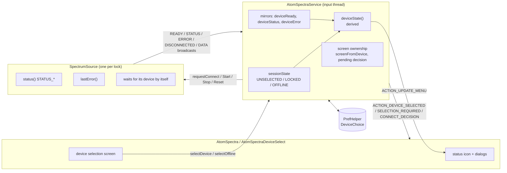
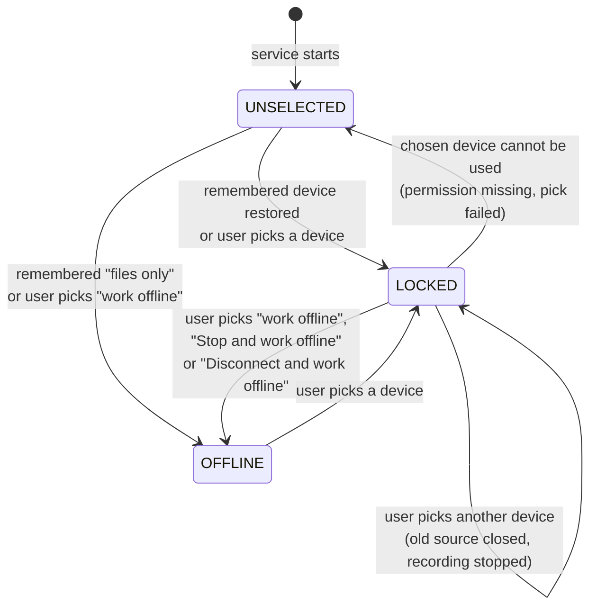
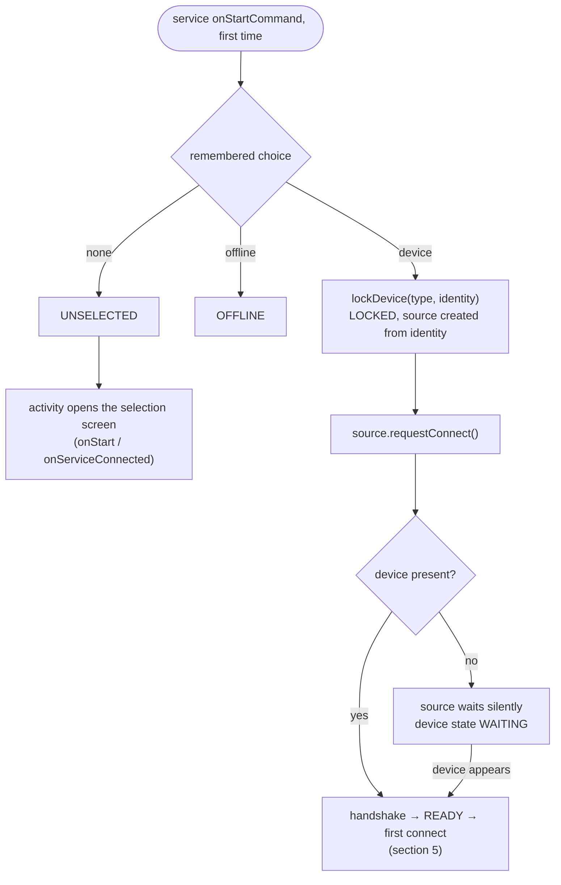
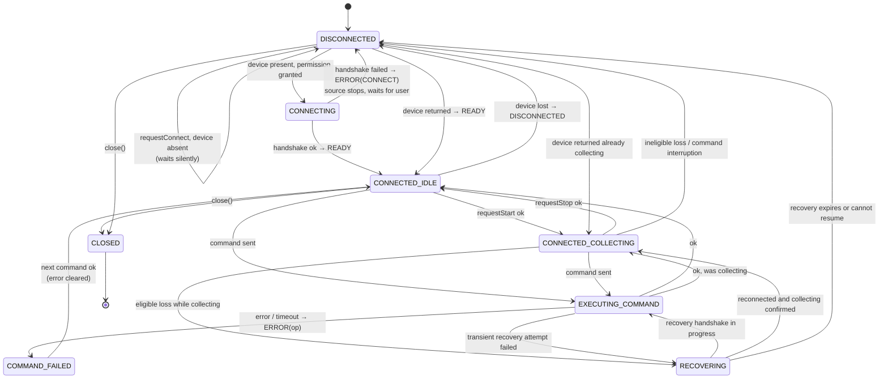
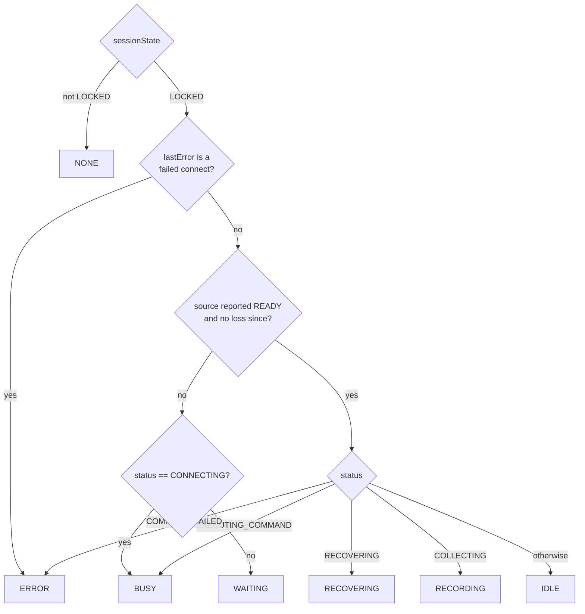
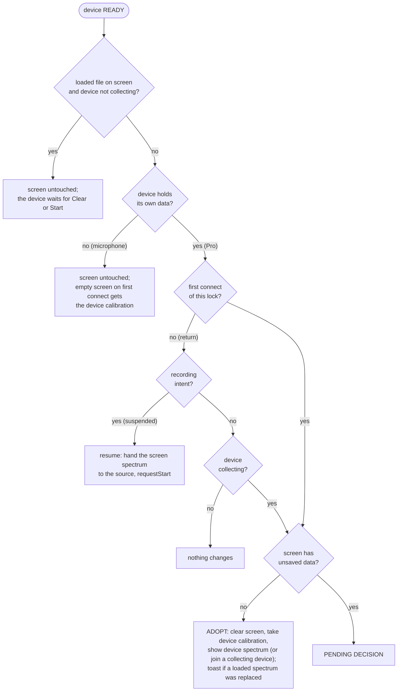
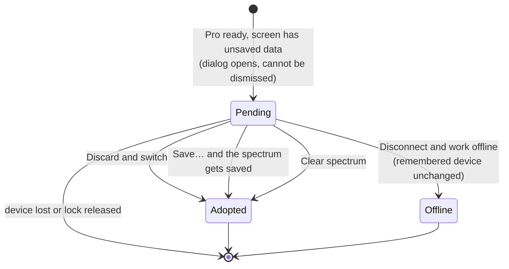

# Device session state machine

How `AtomSpectraService` and the spectrum sources (`AtomSpectraAudioSource`, `AtomSpectraProSource`, `BluZBleSource`) decide which device the app works with, whether it is there, and what happens to the spectrum on the screen when a device comes, goes or starts recording.

Diagrams are Mermaid; they render on GitHub and in most IDE markdown previews.

> Updated 2026-10-07: debug Java compilation succeeds using the existing JDK/Android
> SDK. Recovery behaviour has not been verified on physical hardware; no ADB
> device/emulator was attached.

## 1. The idea in one picture

The UI never shows "a state"; it shows a **pair**:

```
session state  (what the user chose)   +   device state  (what the chosen device is doing)
UNSELECTED | LOCKED | OFFLINE               NONE | WAITING | IDLE | RECORDING | BUSY | RECOVERING | ERROR
```

The device state only exists while the session is `LOCKED`, and it is **derived**, never stored: it is computed from the source's status, whether the source has reported ready, and the source's last error.



Responsibilities:

| Layer | Owns | Does not do |
|---|---|---|
| Source | Talking to the hardware, waiting for an absent device, noticing loss and return, `status()`, `lastError()` | Decide what the user wants, touch the screen spectrum |
| Service | The lock, the remembered choice, recording intent, who produced the screen spectrum, mirrors for the UI, user-requested recovery | Scan for devices, implement transport retries |
| UI | Showing the pair, asking the user, the selection screen | Any state of its own |

### BluZ Source

Wire states, transmission timing, frame headers and command payloads are in
[bluz-device-protocol.md](bluz-device-protocol.md). Handler ownership, callback
validation, frame-confirmed operations, recovery deadlines, deferred Stop and
shutdown are described in [BluZ threading and connection lifecycle](bluz-threading.md).

BluZ can silently recover an eligible collecting device without suspending the
service's recording. A returned idle device follows the normal disconnect/ready
resume flow. Recovery remains a device state within the existing locked session.

Selection discovery is separate from source waiting and never owns a GATT.
Bluetooth-off produces a persistent selection-screen warning and enable action;
permission denial or absent BLE hardware are distinct states. Audio, USB and
offline choices remain usable. Device-type icons are vectors with existing
status badges above them; WAITING dims only the base icon.

The picker keeps connection status and Bluetooth controls below the device list,
without blocking a replacement choice while connecting. The chosen row is marked.
Saved devices remain listed when absent, with an unavailable label separate from
permission requirements. Paired Bluetooth devices are unavailable until detected
by the current picker scan, but can still be selected for a connection attempt.
A connected locked device remains available even when it is not advertising.
Unavailable USB/audio devices cannot be selected until present; missing microphone
permission can still be requested. Discovery availability does not change the
service's lock or its reconnection behavior.

### Spectra Pro Source

Thread ownership, callback invalidation and detailed sequence diagrams are in
[Spectra Pro threading and connection lifecycle](spectra-pro-threading.md).

USB events, requests, command replies, recovery deadlines and the data watchdog
run on one dedicated source handler. The serial worker only assembles packets
and posts them with a connection generation. Teardown invalidates that generation
before cancelling commands and closing the transport; old packets, serial
callbacks and command timeouts cannot affect a replacement connection. Cancelled
commands do not report artificial connection failures. The worker can exit
without waiting for lifecycle locks, and `close()` waits for source cleanup.

The device has five seconds to return during silent recovery. Once a permitted
reconnect starts, a separate bounded 26.6-second deadline covers the four-command
handshake and transient retries without resetting the budget. Commands still
report busy; collecting confirmation completes recovery. Stop cancels recovery
and retains a Stop-on-return request.

### Audio Source

Audio handler ownership, PCM handoff, capture confirmation, recovery and shutdown
are described separately in
[Audio source threading and capture lifecycle](audio-source-threading.md).

## 2. Session state (what the user chose)



| State | Meaning | Source held? | Selection screen |
|---|---|---|---|
| `UNSELECTED` | Nothing chosen, nothing remembered or the choice could not be used | no | opens automatically, cannot be dismissed |
| `LOCKED` | A device is chosen. The device may be present or absent | yes, exactly one | optional (status icon → switch) |
| `OFFLINE` | Files only | no | optional |

`LOCKED` deliberately does not say "connected". That is the device state.

### Remembered choice (`DeviceChoice`)

Stored in app preferences as one of: none, offline, or device (type + identity + display name).

| Event | Remembered choice |
|---|---|
| User picks a device and it **connects** | device |
| User picks "work offline" in the selection screen | offline |
| "Stop and work offline" in the recording-suspended dialog | **unchanged** |
| "Disconnect and work offline" in the connect decision dialog | **unchanged** |
| Device lost, waiting, errors | unchanged |
| Pick fails, or permission is missing (falls back to `UNSELECTED`) | unchanged, so the next launch tries again |

### Startup



## 3. Source status (what the device is doing)

Sources report through broadcasts: `READY`, `STATUS`, `ERROR`, `DISCONNECTED`, `DATA`. A source that cannot find its device is **not** in error: it stays `STATUS_DISCONNECTED`, waits for it (USB attach, audio device callback, or BLE scan) and connects when it shows up. On loss while collecting, audio, Pro USB and BluZ may first enter `STATUS_RECOVERING`; losses while idle or during a command use the regular disconnect/error path.



Audio and Pro USB use a 5-second recovery window after loss while collecting. Audio restarts capture when the selected input returns within the window. Pro USB reconnects and checks device status; if it is still collecting, recovery completes in place, otherwise it reports a disconnect and follows the regular ready/resume flow. The Pro source also has a data watchdog that reconnects a silent serial link by itself; that watchdog runs independently of physical detach recovery.

BluZ's bounded, progress-extended scan-based recovery window is described in [BluZ threading and connection lifecycle](bluz-threading.md). `RECOVERING` is a source status, not a separate session state. It is shown only while the source has already reported ready; after a reported disconnect the device state returns to `WAITING`.

### Recovery Event Contract

All three sources use the same recovery outcomes. Busy may be an intermediate
status; recovery is an episode, not a requirement to remain in one status until
the device returns.

| Outcome | Source reporting |
|---|---|
| Eligible collecting loss | Emit `STATUS_RECOVERING` |
| Collecting is confirmed again | Emit `STATUS_CONNECTED_COLLECTING`; do not emit `READY` |
| Device unavailable or recovery budget exhausted | Set disconnected and emit `DISCONNECTED` |
| Returned device is idle | Emit `DISCONNECTED`, then `READY` with idle status |
| Terminal recovery failure | End recovery, emit `DISCONNECTED`, then `ERROR(OP_CONNECT)` |
| Stop during recovery | End recovery and emit `DISCONNECTED`; use ordinary readiness if the device is available |

The service latches recovery independently of `deviceStatus`. It logs recovering
once per episode and recovered once on the collecting status event, including
after a busy handshake. Disconnect, readiness and terminal connect errors end
the latch. Stop clears recovery intent and suppresses a late recovered log.
There is no persistent recovered status.

Transient reconnect/setup failures retry within the source's existing budget
without terminal errors. Permission loss remains terminal and lets the service
release the unusable session. Transport-specific timeout values and retry pacing
are documented in the three source threading documents.

An idle-ready event after disconnect is ordinary initialization: the service,
not the source recovery path, decides whether to restart acquisition. A device
that returns after Stop must not auto-start; Pro and BluZ retain a Stop-on-return
intent until idle is established.

## 4. Device state (derived) and what the user sees

`deviceState()` in the service:



| Device state | Icon (base = mic / USB / none) | Tap on the icon | Requirement |
|---|---|---|---|
| `NONE` | base icon, no badge | selection screen | |
| `WAITING` | base icon dimmed + orange clock badge | selection screen | 7A |
| `IDLE` | base icon + pause badge | selection screen | 7B |
| `RECORDING` | base icon + red dot | selection screen | 7C |
| `BUSY` | base icon + hourglass | selection screen | 7D |
| `RECOVERING` | base icon + recovering badge | selection screen; record toggle unavailable | |
| `ERROR` | base icon + amber triangle "!" | error text, **Retry** (failed connect only), **Select device** | 7E |

While a connect decision is pending (section 5), a tap on the icon reopens that decision dialog instead.

Badges are `res/drawable/badge_*.xml`, drawn in the lower-right of a shared 24×24 viewport and stacked over the base icon in a `LayerDrawable`.

The foreground notification text follows the same pair: suspended recording, error, waiting, no device, recording, paused.

## 5. The screen spectrum and the device

The service owns the spectrum on the screen. Two facts decide what a device may do to it.

**Who produced the screen content.** `screenFromDevice` is true once the connected device has written to the screen in the current lock. It becomes false when a device is locked, a file is loaded, a spectrum is added from a file, or the screen is cleared.

**Whether the user loaded it.** `screenFromFile` is true after a file is loaded or added. It becomes false when the screen is cleared, the device takes the screen over, or recording writes to it. Locking, losing or releasing a device does not change it.

**Whether the content is unsaved.** `foreground.isChanged()`. A loaded file, an empty screen and a saved spectrum are clean.

**Two kinds of device.**

| Kind | Example | Has data of its own | Can continue a spectrum it is given |
|---|---|---|---|
| Holds its own data | Spectra Pro | yes, a histogram in hardware | no |
| Follows the screen | microphone | no | yes, if the channel count matches |

Rule: **a spectrum the device did not produce is never replaced without the user knowing, and unsaved data is never lost without being asked.** There are three moments where a device could overwrite the screen; each has the same answer.

### Connect and return



### Connect decision

A device that holds its own data cannot show it without replacing the screen. When the screen has unsaved data, the service waits for the user. While it waits the device data is ignored and recording cannot start.



| Button | Effect |
|---|---|
| Save… | starts the regular save flow; when the spectrum is saved the device takes the screen over by itself |
| Discard and switch | the unsaved spectrum is dropped, the device takes the screen over |
| Disconnect and work offline | the device is released, the session goes `OFFLINE`, the remembered device is unchanged |

The service cannot show a dialog itself. It sends `ACTION_DEVICE_CONNECT_DECISION`; the activity shows the dialog when it is in front, and shows it again from `onStart`, from the service binding and from a tap on the status icon while the decision is pending.

### Start

Pressing record asks the service what has to be decided first (`startDecision()`):

| Screen content | Microphone (can continue) | Pro (cannot continue) |
|---|---|---|
| Empty, or produced by the device | start | start |
| A saved spectrum from elsewhere | **Continue** / **Start new** / Cancel | start; the screen is cleared to the device's channel count and calibration (toast) |
| An unsaved spectrum from elsewhere | **Continue** / **Discard and start new** / Cancel | **Save…** / **Discard and start new** / Cancel |

"Continue" is offered only when the source can start from a supplied histogram and the channel counts match. It hands the screen spectrum to the source, which goes on with it under the screen's calibration. "Start new" and "Discard and start new" clear the screen first and apply the device calibration. "Save…" starts the regular save flow; after saving, the screen is a saved spectrum and recording starts without a question.

A start request that needs a decision and carries none is refused, so no path replaces the screen by accident.

### Data

- Idle snapshots from a device never overwrite a loaded file, nor unsaved data the device did not produce.
- Device data is ignored while a connect decision is pending.
- Switching device never asks anything by itself: the screen stays as it is, and the question is asked when the new device connects (if it holds its own data) or when recording starts.

### Loading a file

| Situation | Behaviour |
|---|---|
| Recording (menu, "Open with", share) | refused with a toast |
| Screen has unsaved data | **Save…** / **Discard and open file** / Cancel, before the file picker opens (after it for "Open with"); after a successful save the load goes on |
| Otherwise, offline or with any device locked | loads; the device stays locked and leaves the file on screen until Clear, Start, or the device is found collecting |

## 6. Loss and return

```mermaid
sequenceDiagram
    participant U as User / UI
    participant S as Service
    participant D as Source

    Note over S,D: LOCKED, RECORDING
    alt eligible collecting loss (Audio, Pro USB, or BluZ)
        D->>S: STATUS RECOVERING
        S->>U: RECOVERING indicator; recording intent retained
        alt recovery succeeds before its deadline
            D->>S: collecting confirmed / READY
            S->>S: remain RECORDING; no suspension episode
        else recovery expires or cannot resume
            D->>S: DISCONNECTED
            S->>S: deviceReady = false → WAITING<br/>recording intent kept → recording suspended
        end
    else idle loss, command interruption, or unsupported recovery
        D->>S: DISCONNECTED
        S->>S: deviceReady = false → WAITING<br/>recording intent kept → recording suspended
    end
    opt source has reported DISCONNECTED
        S->>U: suspended dialog "Wait for device" / "Stop and work offline"
        opt user chooses "Wait for device"
            U->>S: acknowledge current suspension episode
            U->>U: dismiss dialog; indicator and notification remain suspended
        end
        opt user selects same device in picker
            U->>S: selectDevice(same type and identity)
            S->>D: requestConnect if not connected
            S->>S: keep source, spectrum ownership and recording intent
            S->>U: ACTION_DEVICE_SELECTED (picker may close while waiting)
        end
        alt device returns after a reported disconnect, with or without user action
            D->>S: READY
            opt device is not already collecting
                S->>D: push screen spectrum, requestStart
            end
            S->>U: dialog dismissed, RECORDING again
        else user chooses "Stop and work offline"
            U->>S: stopAndGoOffline()
            S->>S: recording stopped, OFFLINE<br/>remembered device unchanged
        end
    end
```

While suspended there is no way to load a file (loading is blocked while the recording intent is set), so a resume always lands on the spectrum that was being recorded.

Acknowledgement is held by the service for one suspension episode and survives
activity recreation. It does not stop recording, release the device or request a
connection. A later loss creates a new episode and warns again. An acknowledgement
from an old dialog cannot suppress a newer episode.

Same-device selection is determined on the input thread using source type and
stable identity, including if the device returned while the picker was open. It
does not create a new source, reset the spectrum, or enter first-connect adoption.
Return follows `onDeviceReturned`; hardware-owned spectra continue updating from
the device. Selecting a different device or working offline keeps the existing
switching and spectrum-protection rules.

`requestConnect()` ensures connection or source-owned waiting, retries a failed
connect, and leaves an existing connection attempt alone. Repeated requests do not
clear acquisition data. This is not a forced transport restart; UI and service do
not implement transport retries. During `RECOVERING`, the service keeps the
recording intent but blocks start/stop actions until recovery succeeds or the
source reports a disconnect.

## 7. Errors

| Kind | Origin | State | Recovery |
|---|---|---|---|
| Permission missing or denied at connect (`REASON_PERMISSION`) | microphone permission, USB permission | session falls back to `UNSELECTED`, toast, selection screen opens | user picks a device; remembered choice untouched |
| Failed connect (`OP_CONNECT`), not permission | handshake error, port open failure | session stays `LOCKED`, device state `ERROR`, the source stops trying | status dialog: **Retry** (`retryConnect`) or reselect the same device. No automatic retry |
| Failed command (`OP_START`, `OP_STOP`, `OP_RESET`, `OP_CALIBRATION_SAVE`, …) | timeout, device error | device state `ERROR` while status is `COMMAND_FAILED`; a start/stop failure reverts the recording intent; toast | clears by itself when the source next reaches idle or collecting |
| Pick failed during selection | any of the above while the user is choosing | session `UNSELECTED`, `ACTION_DEVICE_SELECTION_REQUIRED` carries the text, the selection screen shows it | user picks again |

The error itself lives on the source (`SpectrumSource.lastError()`), is cleared by the source when it recovers, and is mirrored by the service after each reply.

## 8. Selection screen

The following flow applies to a different device. Reselecting the locked device
keeps the session, requests connection if needed, and does not gate leaving the
picker during recovery. The picker displays waiting, connecting, recovering or error status
for suspended recording and refreshes on `ACTION_DEVICE_STATE_CHANGED`, emitted
for source lifecycle, selection, recovery and recording-state updates, not menu
refreshes. An already-recording
session never receives another start command from the picker. An initial pending
selection still uses the first-connect result flow.

```mermaid
sequenceDiagram
    participant U as Selection screen
    participant S as Service
    participant D as New source

    U->>S: selectDevice(descriptor)
    S->>S: stop recording, close old source, LOCKED,<br/>selectionPending = true
    S->>D: requestConnect()
    alt connects
        D->>S: READY
        S->>S: remember device, reconcile screen (section 5)
        S->>U: ACTION_DEVICE_SELECTED
        U->>U: finish; start recording if requested<br/>and nothing has to be decided first
    else fails / vanishes / permission
        D->>S: ERROR or DISCONNECTED
        S->>S: UNSELECTED
        S->>U: ACTION_DEVICE_SELECTION_REQUIRED (+ text)
        U->>U: toast, list stays
    end
```

The screen cannot be left (Cancel hidden, back disabled) while the session is `UNSELECTED` or a pick is pending. It can be left freely once a device is locked or offline.

## 9. Requirements map

| # | Requirement | Where it is met |
|---|---|---|
| 1 | Pick a device at startup | `UNSELECTED` opens the selection screen |
| 2 | Remember the choice, auto-connect, wait if absent | `DeviceChoice`, `restoreDeviceChoice`, source-owned waiting |
| 3 | Switch devices while running | `selectDevice`: old source closed, recording stopped |
| 4 | Warn before unsaved data is replaced or lost | connect decision, start decision, load confirm, exit confirm when `isChanged()` |
| 5 | Device lost while recording: warn, wait or stop and go offline, preference unchanged | suspension episode acknowledgement or `stopAndGoOffline()` |
| 6 | Device back, no action: recording resumes | `onDeviceReturned` |
| 7 | UI always shows the pair, states A–E | `deviceState()` + badges, section 4 |

## 10. Known limits

- The notification's **Exit** action goes straight to `ACTION_STOP_FOREGROUND`; only the menu's Exit asks about unsaved data.
- "Save…" starts the regular save flow, which can be cancelled. The decision then stays pending; a tap on the status icon reopens the dialog.
- Only the native spectrum save marks the screen as saved. The export formats (SPE, N42, …) do not.
- A spectrum can be continued on the microphone whenever the channel counts match, including one recorded by another kind of device; calibration and instrument differences are the user's call.
- A remembered Pro without USB permission makes the system permission dialog appear from the background wait; if the user refuses, the session falls back to `UNSELECTED`.
- A `COMMAND_FAILED` source relies on the source to recover; the service does not poll it.
- Audio devices that re-enumerate with a different product name are a different identity and are not recognised as "the same device returning".
- The source recovery state and UI have only been compile-checked; their timing
    and indicator behaviour have not been verified on a physical device.
