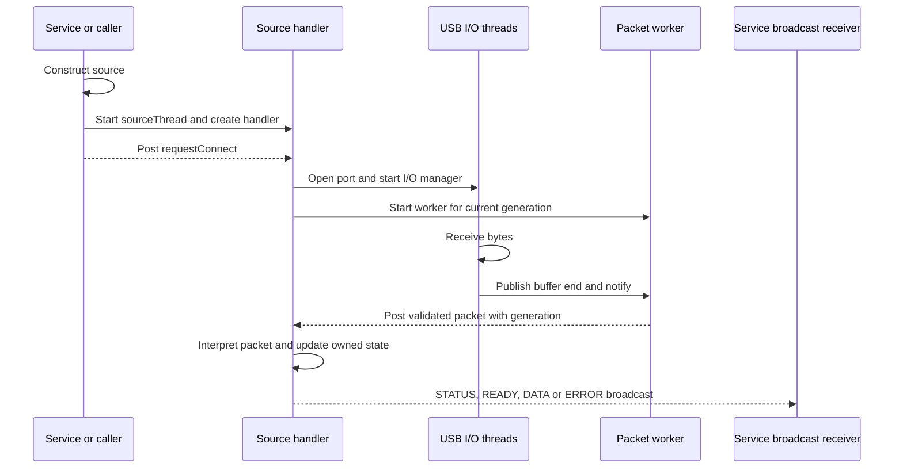
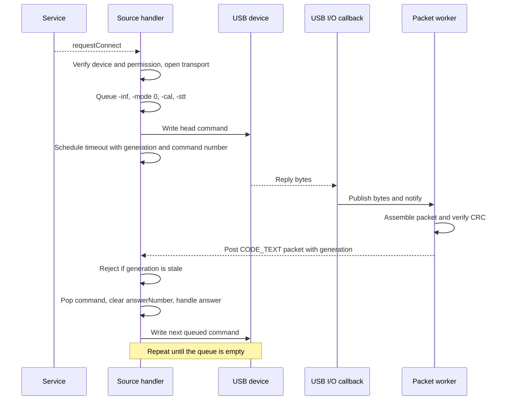
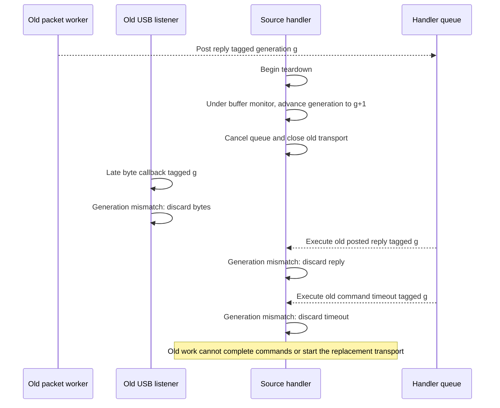
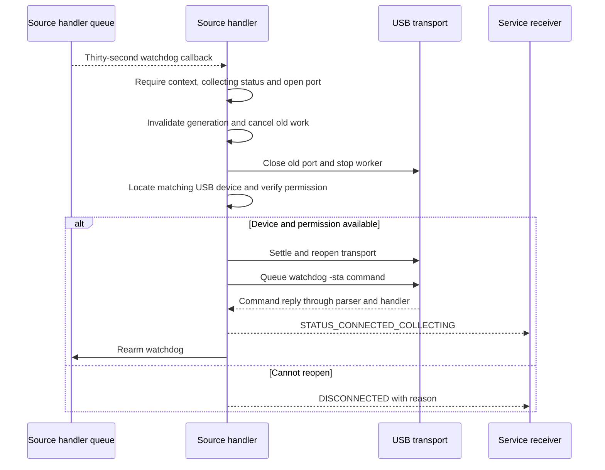

# Spectra Pro threading and connection lifecycle

This document describes the current implementation of
[AtomSpectraProSource](../app/src/main/java/org/fe57/atomspectra/AtomSpectraProSource.java).
It covers thread ownership, cross-thread communication, command ordering,
connection invalidation, recovery deadlines and shutdown. Application-level
recording and device selection are covered separately in
[Device session state machine](device-state-machine.md).

The central rule is: **one source handler owns connection decisions; USB I/O
and packet assembly feed it without waiting for those decisions.**

The sequence diagrams below use Mermaid. An asynchronous arrow represents a
posted task or broadcast, not a synchronous Java method call.

## 1. Execution contexts

| Context | Lifetime | Responsibilities | Must not do |
|---|---|---|---|
| Caller, usually the service | External to the source | Issue requests, read published status/calibration, call `close()` | Mutate the command queue or transport fields directly |
| `sourceThread`, named `AtomSpectraProSource` | Created in the constructor; stopped by `close()` | Run `asyncTasksHandler`, own connection lifecycle, USB events, requests, command results, packet interpretation and timers | Wait for a worker that needs a lifecycle decision to exit |
| Library-managed USB I/O threads | Associated with a `SerialInputOutputManager` created during port opening | Deliver received bytes and serial errors | Complete commands, change source status or reconnect |
| `processingThread`, named `AtomSpectra-Packet-Processor` | Created for each opened transport; interrupted and joined during teardown | Assemble byte streams into packets, unescape bytes, validate CRC and post complete packets | Handle command results, write commands or acquire lifecycle locks |

`sourceThread` is not the Android main thread and is not the service's input
thread. A source instance owns its own handler and packet worker. The USB
receiver is registered with `asyncTasksHandler`, so detach, attach and permission
results execute on the same handler as requests and command results.

The source writes commands directly through `UsbSerialPort.write()` on the
source handler. The library listener is used for received bytes and serial
errors; the source does not enqueue its commands through an asynchronous library
write API.



## 2. State ownership and visibility

Most mutable state is confined to the source handler. Thread confinement, rather
than a collection of nested locks, makes lifecycle transitions mutually
exclusive.

| State | Writer / owner | Cross-thread access |
|---|---|---|
| `device`, `driver`, `connection`, `port`, `manager`, `processingThread` | Source handler | Workers receive captured connection identity rather than reading these fields to make decisions |
| `commands`, `answerNumber`, `pendingBatches` | Source handler | None; packet interpretation and command timeouts run on this handler |
| `histogram`, received-bin flags, sweep tracking and unreliable-report counter | Source handler | Parser posts packet arrays; it does not update histogram state |
| `recoveryDeadline`, recovery scheduling and watchdog scheduling | Source handler | No independent timer thread decides to tear down the connection |
| `status`, `lastError`, `deviceId`, `calibrationCoeffs` | Source handler | Volatile publication; getters may be called by other threads |
| `context` | Cleared by the source handler during close | Volatile; used to reject work after closure |
| `connectionGeneration` | Source handler, incremented under `circularBufferSync` | Volatile; captured by listeners, workers and command timeout tasks |
| `inputData`, `inputDataHead`, `inputDataEnd` | USB producer and packet consumer | Circular-buffer protocol, volatile indices and `circularBufferSync` |
| Packet-error maps and suppression bookkeeping | Packet worker and source handler | Protected by `errorReportingLock` |
| `CommandCode.NextNumber` | Command constructors across source instances | Protected by the remaining static `CommandCode.sync` monitor |

`calibration()` returns a copy, not the mutable calibration array. Volatile
fields publish individual values; they do not make a group of getter calls an
atomic snapshot. The public `histogram` field is not a synchronized read API;
normal consumption uses the source's data broadcasts.

Some fields retain `volatile` even though their lifecycle writes are now
handler-owned. That does not give external code permission to change their
ownership model.

### Remaining synchronization

`circularBufferSync` coordinates the byte producer with the packet consumer.
The producer copies bytes and publishes the new end index while holding it.
The consumer waits for a changed end index under the same monitor, then parses
outside the monitor. Generation invalidation uses this monitor too, so it cannot
interleave halfway through an old listener's byte-buffer write.

The circular buffer is single-producer/single-consumer for the active transport.
The producer does not overwrite unread bytes; the consumer advances the volatile
head index as it consumes them. Publishing the end index makes the preceding
byte writes visible to the consumer. On overflow, excess bytes are dropped and
logged rather than overwriting unread data.

`errorReportingLock` remains because malformed-packet accounting happens in the
packet worker while summary logging and suppression reset happen on the source
handler. It protects logging state, not connection decisions.

The former `connectionLock`, `syncCommand`, `batchSync` and `watchdogSync` are no
longer needed. Their state has a single handler owner. `CountDownLatch` in
`close()` is a completion signal, not a lifecycle lock.

## 3. Request dispatch

Public operations use `deferToSourceThread()`:

1. If the source is already closed (`context == null`), do no work.
2. If the caller is the source handler, execute immediately.
3. Otherwise, post the operation to the source handler and return. The posted
   operation checks closure again before executing.

This applies to connection, acquisition, stop/reset, calibration, preferences
and unsupported initial-histogram requests. A calibration request copies the
caller-supplied coefficients before crossing the thread boundary.

A returned `requestStart()` or `requestConnect()` call does not mean the device
has completed that operation. Completion is reported by source broadcasts.
`close()` is intentionally different: an off-handler caller waits for cleanup.

Messages on the handler execute one at a time. Immediate work already running
on that handler can call another owner method directly; there is no intervening
cross-thread lifecycle mutation. Between different producers, the order that
matters is the order in which the handler actually processes their messages.

## 4. Connecting and completing commands

The normal connection handshake queues four text commands:

| Order | Command | Purpose |
|---|---|---|
| 1 | `-inf` | Read firmware information |
| 2 | `-mode 0` | Select spectrometer mode |
| 3 | `-cal` | Read calibration and device identity |
| 4 | `-stt` | Confirm whether the device is collecting |

`enqueueTextCommand()` appends to the handler-owned queue and publishes
`STATUS_CONNECTED_EXECUTING_COMMAND`. `sendPacket()` writes only its head.
`answerNumber` records the command currently awaiting a reply, so subsequent
enqueue calls do not resend that command.



The command reply is interpreted only on the source handler. The parser never
pops commands and never invokes `handleDeviceAnswer()`.

### Command timeout and errors

Each successful write schedules a timeout after `CommandCode.DROP_TIMEOUT +
500`, currently 5.5 seconds. The USB write itself has a one-second timeout.

Before changing the queue, a command timeout checks:

1. The source is still open as an object (`context != null`).
2. Its captured generation is still the current connection generation.
3. Its command number is still the command awaiting an answer.

A reply that already completed the command makes the number check fail. A
teardown makes the generation check fail. Completed commands' timeout tasks
need not be individually removed for correctness.

Genuine write errors, negative replies and command timeouts still use the normal
error path. Calibration batches aggregate command results on the source handler;
a failed batch drains its remaining queued commands before calling its callback.
Connection teardown instead cancels the queue and batch bookkeeping without
inventing command failures.

The generation check does not create a command identifier in the device's wire
protocol. A delayed device reply within the same connection is still interpreted
according to the existing ordered-command protocol; connection invalidation only
rejects work from an older transport lifetime.

## 5. Live spectrum packets

Packet assembly and packet interpretation are separate operations:

- `searchPacket()` runs in the worker: find packet boundaries, unescape bytes and
  validate length and CRC.
- `findPackets()` posts each complete, independently allocated packet array with
  the generation captured when the worker started.
- `handlePacket()` runs on the source handler: update histogram bins, process
  command replies and publish spectrum reports.

```mermaid
sequenceDiagram
    participant Device as USB device
    participant USB as USB I/O callback
    participant Buffer as Circular buffer
    participant Parser as Packet worker
    participant Owner as Source handler
    participant Service as Service receiver
    Device-->>USB: Histogram and DATA bytes
    USB->>Buffer: Lock, validate generation, copy bytes
    USB->>Buffer: Publish end index and notify
    USB->>Buffer: Unlock
    Buffer-->>Parser: Wake with new end index
    Parser->>Parser: Assemble CODE_HIST packet
    Parser-->>Owner: Post packet with captured generation
    Owner->>Owner: Validate generation and update histogram
    Parser->>Parser: Assemble CODE_DATA packet
    Parser-->>Owner: Post packet with captured generation
    alt Recovery handshake still pending
        Owner->>Owner: Reset completeness; do not publish acquisition data
    else Report complete or incomplete data
        Owner-->>Service: DATA or DATA_SKIPPED
        Owner->>Owner: Reset completeness and refresh watchdog
    end
```

Because histogram interpretation and start/reset completion share the handler,
they cannot concurrently modify received-bin tracking. Packets produced by one
worker are posted in their assembly order. Unrelated handler messages can execute
between them.

CRC and malformed-packet reports remain worker-side logging operations protected
by `errorReportingLock`; they are not command or connection state transitions.

## 6. Connection generations

`connectionGeneration` identifies a transport lifetime inside one source
instance. It is distinct from the source instance ID used by the service to
reject broadcasts from a replaced source object.

When opening a transport, the source captures the current generation in:

- The `SerialInputOutputManager.Listener` installed for that transport.
- The packet worker created for that transport.
- Each command timeout scheduled by that transport.

`postForConnection()` always posts an owner task. When it executes, it checks
both object closure and generation equality before running the task.

Teardown increments the generation **before** cancelling commands or releasing
hardware. It does not rely on removing every old queued callback.



The byte callback checks generation while holding the buffer monitor. Teardown
increments it under that same monitor. Either the old write finishes before
invalidation, or its callback observes the new generation and does nothing.
Before reusing buffer indices, teardown joins the old parser.

## 7. Silent USB recovery and near-expiration reconnect

Detach while collecting is eligible for silent recovery. Detach while idle or
busy takes the regular disconnect path. The status may be busy during a recovery
handshake; `recoveryConnectPending`, not the visible status alone, tracks that
handshake after commands have been queued.

Recovery has two budgets:

| Stage | Budget | Start |
|---|---|---|
| Waiting for the device to return | 5 seconds | Eligible detach, after old transport teardown |
| Reopening and confirming collecting state | 26.6 seconds | `requestConnect()` has a device with permission and begins a recovery reconnect |

The second budget is `USB_WAIT_DEVICE + 4 * (CommandCode.DROP_TIMEOUT + 500 +
SERIAL_MANAGER_WRITE_TIMEOUT)`: 600 ms plus four command timeout/write budgets.
It is a bounded handshake allowance, not an extension granted by arbitrary
incoming spectrum data.

```mermaid
sequenceDiagram
    participant Android as Android USB events
    participant Owner as Source handler
    participant Queue as Handler deadlines
    participant Device as Returned device
    participant Service as Service receiver
    Android-->>Owner: Detach while collecting
    Owner->>Owner: Invalidate old generation and tear down transport
    Owner-->>Service: STATUS_RECOVERING
    Owner->>Queue: Schedule five-second return deadline
    Android-->>Owner: Matching attach processed near deadline
    Owner->>Owner: Check permission and replace stale UsbDevice token
    Owner->>Owner: Wait for USB settling
    Owner->>Queue: Replace return deadline with handshake deadline
    Owner->>Device: Open transport and run four-command handshake
    Owner-->>Service: STATUS_CONNECTED_EXECUTING_COMMAND
    opt An obsolete recovery callback is encountered
        Queue-->>Owner: onRecoveryTimeout
        Owner->>Owner: Recheck recoveryDeadline using uptime
        Owner->>Queue: If time remains, reschedule rather than tear down
    end
    Device-->>Owner: Valid -stt reply through USB and parser
    alt Device is collecting
        Owner->>Queue: Cancel recovery timeout
        Owner->>Owner: Clear recovery pending; reset histogram completeness
        Owner-->>Service: STATUS_CONNECTED_COLLECTING
        Owner->>Queue: Arm data watchdog
    else Device is idle
        Owner-->>Service: DISCONNECTED: returned but no longer collecting
        Owner->>Device: Queue initial histogram request
        Owner-->>Service: READY after initial histogram command succeeds
    end
```

No ready event is emitted by the successful collecting recovery path. Ordinary
initial connection and the returned-idle path use their existing ready events.
This threading change does not unify readiness or recovery-log behavior across
device types.

### Timeout racing with a reply

Timeout and packet interpretation share one handler, so their state mutations
cannot overlap:

```mermaid
sequenceDiagram
    participant Queue as Handler queue
    participant Owner as Source handler
    participant Service as Service receiver
    alt Collecting confirmation executes first
        Queue-->>Owner: Valid current-generation -stt reply
        Owner->>Owner: Complete recovery and clear pending flag
        Owner->>Queue: Remove recovery timeout
        Owner-->>Service: STATUS_CONNECTED_COLLECTING
        Note over Owner: A later recovery callback finds no recovery pending
    else Expired recovery timeout executes first
        Queue-->>Owner: Recovery timeout
        Owner->>Owner: Verify current deadline has expired
        Owner->>Owner: Advance generation and cancel commands
        Owner->>Owner: Close transport and join worker
        Owner-->>Service: DISCONNECTED: USB recovery timed out
        Queue-->>Owner: Previously posted reply from old generation
        Owner->>Owner: Reject stale reply; do not call requestStart
    end
```

This ordering fixes both the old stale-reply restart hazard and teardown-generated
command errors. It does not guarantee that a reply physically received before a
deadline will be interpreted before an already-queued timeout. The handler's
execution order determines the winner.

## 8. Data watchdog reconnect

The watchdog is a delayed handler callback, not a `Timer` thread. Successful
collecting operation and spectrum reports refresh its 30-second delay. Stop,
teardown and closure cancel it.



The watchdog cannot concurrently reopen a port while another handler operation
closes it. It must wait until the current owner operation completes.

## 9. Teardown and synchronous close

`teardownConnection()` runs on the source handler in this order:

1. Increment the connection generation under `circularBufferSync`.
2. Clear recovery pending, cancel its timeout and set internal status to disconnected.
3. Cancel the watchdog and clear the command queue and pending batches.
4. Close the port and underlying USB connection.
5. Stop the serial I/O manager.
6. Interrupt and join the packet worker before its buffer is reused.

Teardown sets the internal disconnected status without independently broadcasting
that transition; its caller chooses whether to report disconnect, enter recovery
or reopen immediately. Cancellation does not call command-failure callbacks.

An off-handler `close()` posts cleanup and waits on a `CountDownLatch`. When
already on the source handler, it cleans up directly and never waits on itself.

```mermaid
sequenceDiagram
    participant Caller as Service or caller
    participant Owner as Source handler
    participant USB as USB I/O manager
    participant Parser as Packet worker
    participant Latch as Close completion latch
    Caller-->>Owner: Post close task
    Caller->>Latch: Await cleanup completion
    Owner->>Owner: Unregister USB receiver
    Owner->>Owner: Invalidate generation and cancel scheduled lifecycle work
    Owner->>Owner: Clear commands and batches without synthetic failures
    Owner->>USB: Close transport and stop manager
    Owner->>Parser: Interrupt
    Owner->>Parser: Join without holding a lifecycle monitor
    Parser-->>Owner: Exit; never waits for owner decisions
    Owner->>Owner: Publish CLOSED and clear context
    Owner->>Owner: Request sourceThread.quitSafely
    Owner->>Latch: countDown in finally
    Latch-->>Caller: Return from close
```

Interrupted waits do not abandon cleanup: both the caller's latch wait and the
worker join continue waiting and restore the interrupted flag afterward. A
successful off-handler close returns after hardware and worker cleanup, not
necessarily after the handler thread's final Looper exit. Immediate messages
that survive `quitSafely()` are rendered harmless by closure/generation guards;
future delayed work is not executed by that exiting Looper.

The worker does not synchronously wait for packet interpretation. This removes
the old cycle where teardown held a lifecycle monitor while joining a worker
that was blocked acquiring that same monitor.

## 10. Scheduling limits and maintenance rules

Serialization establishes ordering, not hard real-time execution. The source
handler can spend time polling USB permission (up to two seconds), sleeping for
USB settling (600 ms), opening/closing hardware or writing a command (up to its
one-second write timeout). Packets and deadline callbacks queue behind that
work. Recovery deadlines use `SystemClock.uptimeMillis()`, matching handler
delays; permission polling uses `SystemClock.elapsedRealtime()`.

Neither the close latch wait nor the worker join has an overall timeout. The
identified lifecycle-lock deadlock is removed, but a stalled hardware/library
operation can still delay shutdown. Large packet backlogs can also delay owner
work; the handler queue does not implement explicit backpressure.

When changing this source:

1. Keep transport, command and histogram interpretation on the source handler.
2. Route off-thread operations through `deferToSourceThread()` or the same handler.
3. Capture a generation when asynchronous work belongs to a particular transport,
   and validate it when the work executes, not only when it is posted.
4. Invalidate the generation before releasing transport resources.
5. Never make the packet worker wait for a synchronous source-handler decision.
6. Do not hold buffer or logging monitors while joining the worker.
7. Keep actual command failures distinct from cancellation caused by disconnect.
8. Preserve synchronous close cleanup when a caller may immediately replace the source.

The implementation has passed debug Java compilation. Per the current request,
no tests were added or run; recovery timing and USB shutdown have not been
verified on physical hardware.